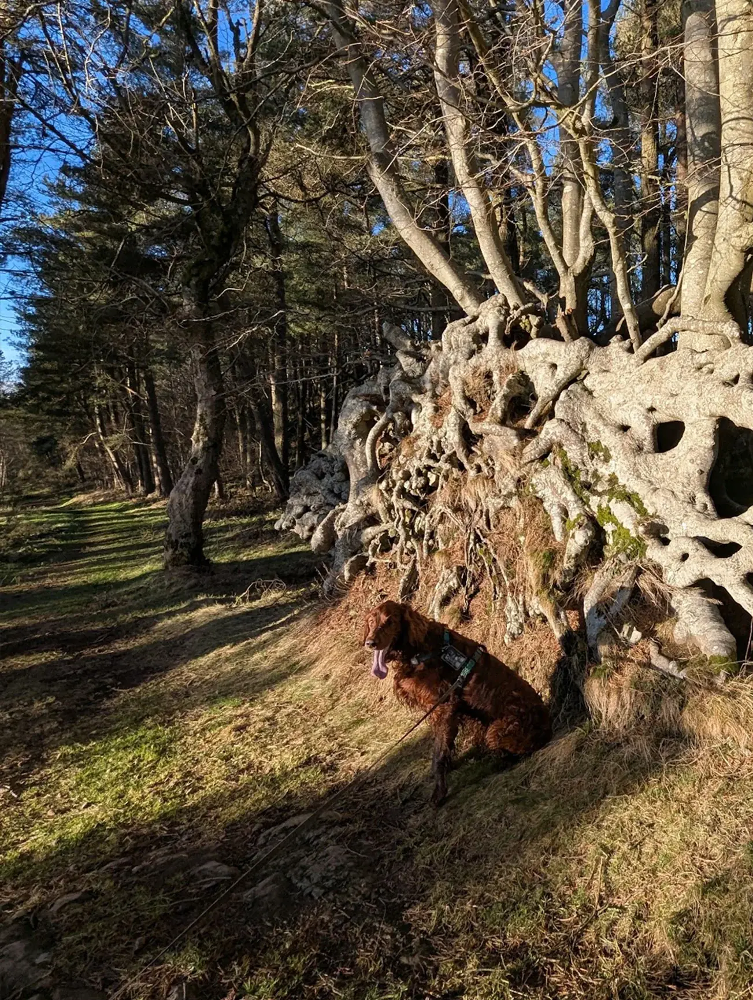
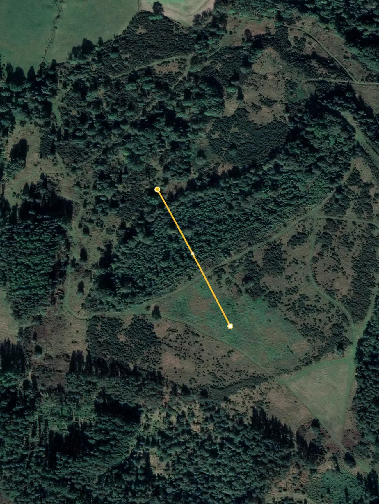
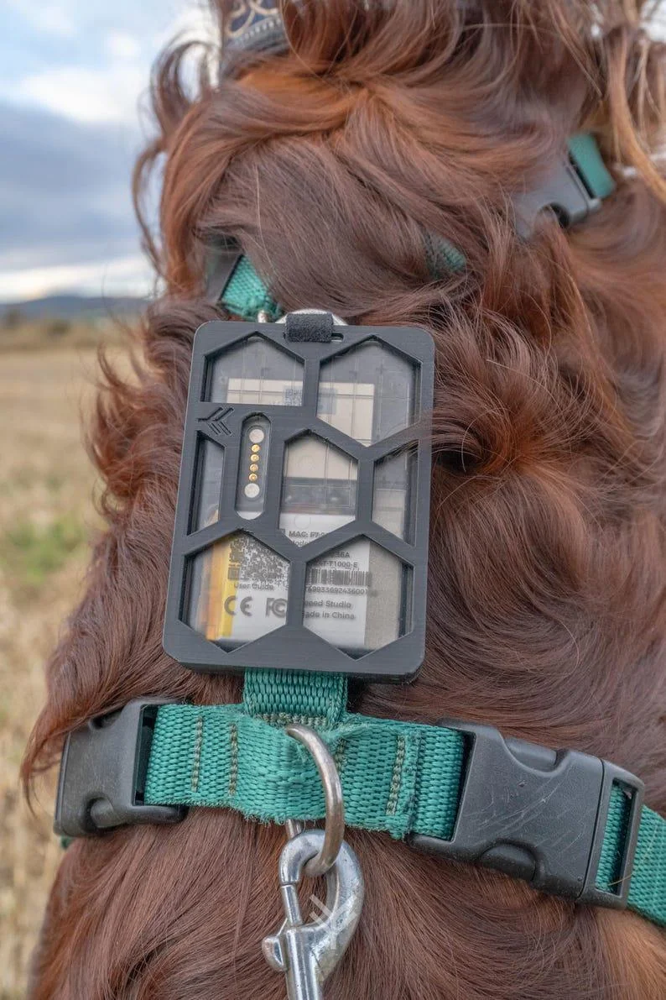
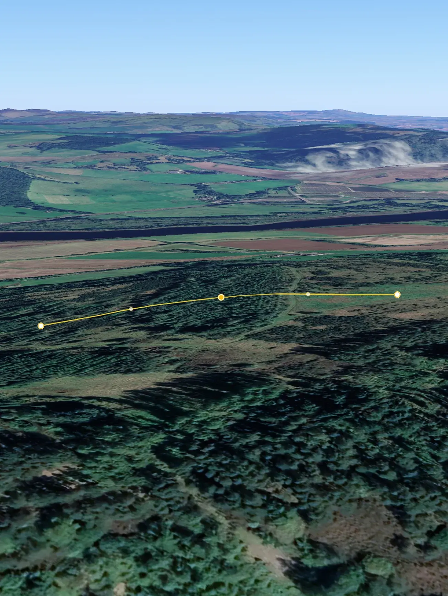



本篇文章所述的案例、故事及评论讨论等信息，均源自 Reddit `/r/meshtastic` 子版块帖子 《[The Use Case I Prepared for Happened: Meshtastic Found My Dog」](https://www.reddit.com/r/meshtastic/comments/1ic7lfl/the_use_case_i_prepared_for_happened_meshtastic/)》。

原帖由用户 *the-high-tek-lowlife* 发布，评论区中也提供了诸多补充与讨论，欢迎读者前往查看原文及完整评论区内容，以获取更全面的讯息。



许多人对 Meshtastic 的初步印象，往往停留在它是一款面向极客群体的开源 LoRa 通讯工具：「DIY 很爽」、「能离线聊天」、「自己搭建个无线网络就像在玩高科技玩具」。但随着越来越多使用者分享他们在真实场景中的实践案例，Meshtastic 显示出远不止于娱乐或实验的潜能。尤其是在无手机信号的户外环境下，Meshtastic 可以提供相对可靠的定位、通讯与紧急联络功能——而且完全独立于常规的蜂窝网络或 Wi-Fi 连接。

本篇文章要讲述的，就是一个亲身经历：如何利用 Meshtastic 在山野丛林里快速寻回走失的爱犬。表面上听来，这似乎是一件极少数人才会碰到的「巧合事件」，但实际上它生动地展示了 Meshtastic 如何在关键时刻解决紧迫问题，也为人们带来更多思考与启发。我们常说「带着它以防万一」，真正遇到紧急情况时，才会发现手头多了一个脱网定位的手段，是多么值得庆幸的事。

在这篇案例分享里，你将看到户外徒步过程中，狗狗意外挣脱了牵引绳，几分钟时间就跑到了一个被松林和地势遮蔽的山谷下方。然而，依靠 Meshtastic 设备的实时位置数据，狗狗的具体方位被清晰地捕捉到，最终让它平安回到主人身边。而且，这次搜寻的节点数量非常有限，却依然能在复杂地形里维持良好的通讯与定位。可以说，这不仅是 Meshtastic「可以做到」，而是「在真正需要时确实做到了」。

接下来的章节里，我们将从狗狗走失的当下情景出发，介绍设备配置、实地寻找与救援过程，并进一步探讨它给我们带来的启示。

希望通过这篇文章，你可以看到 Meshtastic 不仅是社区中众多自制天线、调试固件的乐趣源头，更是能在关键时刻派上大用场的「安心伙伴」。  

## 山顶观景，却发现狗狗不见了

这个故事的开端，如同很多户外爱好者的日常：在一个天气宜人的周末，作者 *the-high-tek-lowlife* 和同伴决定带着他们的狗狗去爬山。行程并不算特别艰难，主要就是想在山顶停留片刻，欣赏一下远处层峦叠嶂的风光。人们在顶峰常常会放松警惕：大家气喘吁吁地休息、喝水、拍照，还会饶有兴致地环顾四周。就在这当口，意外发生了——狗狗挣脱了牵引绳。

最初，没人察觉任何异状。因为在山顶时，他们没有立刻往前走，而是驻足欣赏风景。狗狗的离开并没有伴随吠叫或其他声响，让主人注意到时，它已经跑远了。几分钟的时间足以让一只精力充沛的狗子下到山谷深处，特别是这一带植被茂密，草木葱郁，一只猎物或突如其来的气味都会成为狗狗的目标。

这个情境下，哪怕是有 GPS 手表或者传统手机，也未必能在信号相对薄弱的山谷里第一时间追踪到狗狗。另外，短时间内远距离「搜索」一只热衷追逐野生动物的狗，更是难上加难。若要徒步在山林各个角落呼喊，效率低且极易错过最佳时机。幸运的是，他们随身携带了 Meshtastic 设备，而狗狗的身上也配备了一个相同型号的装置。事实上，当初给狗狗装备 Meshtastic，确实是为了防止这种「可能性很低，但一旦发生就会特别棘手」的场合。

接下来，作者在惊觉狗狗失踪后，立刻掏出配对使用的 Meshtastic 设备，打开地图界面——那一刻，才真正体会到这套系统的「实际用处」：可以实时（或至少非常接近实时）地看到狗狗的坐标，并省去盲目乱找的麻烦。正如他们后面所说：「狗狗当时离我们 200 多米，且因为浓密的松树遮挡，视线完全无法穿透，但定位信号毫不含糊地显示了它的大概方向。」

正是在这样一个惊险又典型的户外场景里，Meshtastic 得以「大显身手」：它帮人们在第一时间确定了搜索范围，为后续快速找回爱犬赢得了宝贵的机会。

## 如何用 Meshtastic 做动物追踪

在这次「寻狗」过程中最引人注目的技术核心，正是 Meshtastic 网络的配置与使用方式。简单来说，Meshtastic 利用低功耗广域网（LoRa）模块来进行远距离无线通讯，同时结合 GPS 定位模块，可以在没有蜂窝网络或 Wi-Fi 覆盖的地方，自组网传播位置与文本通信。对需要追踪的目标——比如调皮的宠物狗——装上一个具有 LoRa 发送功能、并且能持续输出自己定位的节点，就能让你在远距离外掌握它的大致方位。

在具体使用上，作者给狗狗配备的是 Seeed Studio 家的卡片式 T1000-E 设备。该型号设备相对小巧，既内置了 GPS 和防水，又能通过 LoRa 向其他节点广播自己的坐标。

狗狗的背带则配有一个作者自制的 3D 打印外壳，把 T1000-E 紧固其上，这样既不容易掉落，也能避免因为宠物奔跑产生的碰撞或雨水溅湿对电子元件造成影响。平时外出徒步，狗狗身上的这台装置会设为每隔 15 秒发送一次定位信号。

> I designed the case myself, it secures in two parts that clamp on the strap using six hex bolts to hold everything together.

作者自主设计的外壳采用上下两片式结构，通过六个六角螺栓将设备牢牢固定在狗狗背带上，既防脱落又能缓冲奔跑冲击。具体装配示意图和成品照片可参考 [Etsy产品页](https://www.etsy.com/uk/listing/1828068563/sensecap-t1000-e-harness-strap-mount)，3D打印文件已开源在 [Cults3D平台](https://cults3d.com/en/3d-model/gadget/sensecap-t1000-e-harness-strap-mount-animal-tracker-by-physis)。

为了确保数据隐私和电波资源的有效利用，作者在 Meshtastic 里做了这样的配置：

1. 频道区分：  
   - Channel 0（私有频道）：狗狗等家庭成员所携带的节点都连接在这里，保证定位数据只在「内网」共享。  
   - Channel 1（公共频道 / Long-Fast）：如果希望与更广范围的社区节点交换信息或接力发送数据，则可用此频道。作者也曾提到设置 Long-Fast，可提高在远距离或复杂地形的通信成功率。

2. 发射功率与信号模式：  
   - 他们保持了 Meshtastic 默认的长距离预设（Long-Fast），并配合一定的跳数（Hop Distance）配置，让数据包在地形遮挡较强的环境下依然有机会广播到接收端。

3. 电源管理：  
   - 虽然 T1000-E 自带电池可维持数日工作，但户外使用前必须确保充足电量。作者提到自己通常在每次行程后会立即给它充电，避免出门时忘记或电量不足。  
   - 在这次事件里，作者的同伴那台设备就因为电池耗尽而无法使用，所幸作者本人和狗狗的节点都还在正常工作，最终才完成这场「单节点对单节点」的跨越沟通。

4. Beacon 间隔：  
   - 15 秒一次的定位广播并不算太频繁，却也足以让狗狗的实际位置变动能够在地图上及时刷新。万一狗狗像这次这样突然脱离视线，我们也能够依靠最新的坐标数据，在短时间内缩小搜寻半径。

通过上述组合配置，作者实际验证了 Meshtastic 的一个重要优点：即便只有两个正在运行的节点，依托 LoRa 的强大穿透力，依旧可以在山体与树木的重重阻隔间完成数据传输。这种「在困难地形里依旧能收发位置信息」的特性，对于任何有户外探险、远足或动物追踪需求的人而言，都是不可多得的「应急保障」。下一章，我们将讲述作者究竟是如何快速定位并找回狗狗的整个过程，看看这个系统在实战中如何「把理论落到实处」。

## 从定位到搜救的高效流程

一旦察觉到狗狗走失，作者第一反应就是翻开随身携带的 Meshtastic 设备查看地图界面。因为狗狗的节点正处于持续广播状态，地图上很快显示出了它的大致位置：大约在 200~300 米开外的山谷低洼地带，中间还隔着一片相对密集的松林。仅凭肉眼，根本无法穿透这些茂密树木；更何况，带着两个人的队伍若是要盲目地大范围搜寻，势必会浪费大量时间。

然而，这一次有了明确的位置指示，作者和同伴迅速从山顶往下赶，只用了极短的时间，就来到了狗狗所处的区域范围附近。期间，他们会不时地停下脚步，从 Meshtastic 地图上确认最新坐标，确保自己没有跑偏或错过狗狗所在的方位。

到达山谷后，实际并没有立刻看见狗狗——它仍然兴奋地在搜索别的目标，可能是鹿或其他动物。但当他们开始呼喊时，狗狗被熟悉的声音吸引，很快从不远处的树林边探出脑袋。可以说，正因为 Meshtastic 精准标定了搜索范围，他们才能在最短时间内踏进「正确的半径」，顺利与狗狗再度连线并唤回。

在整个寻找过程中，最令人惊叹的是，只有作者和狗狗身上的两个节点保持正常供电并在通讯。面对下山的坡度、山体阻隔和密林覆盖，这一对单节点并没有因为距离或地形而失联，显示出 LoRa 技术在野外环境下确有相当的穿透力与稳定度。要知道，如果没有位置传输，徒步者很可能要在大片区域里四处搜寻，一不小心甚至会导致自己迷路或错过最佳搜救时机。所幸，Meshtastic 的网络在关键时刻发挥了「点到点」的信息传输功能，使主人成功锁定了狗狗所在的具体位置，也大大减轻了精神焦虑和体力消耗。  

借由这样一次亲身体验，作者深刻体会到：当初给宠物配备 Meshtastic 节点，看似是「多此一举」，实际却是一次智慧的投资。万一遇到类似突发状况，依托实时或近乎实时的 GPS 广播，搜寻流程会变得异常高效。