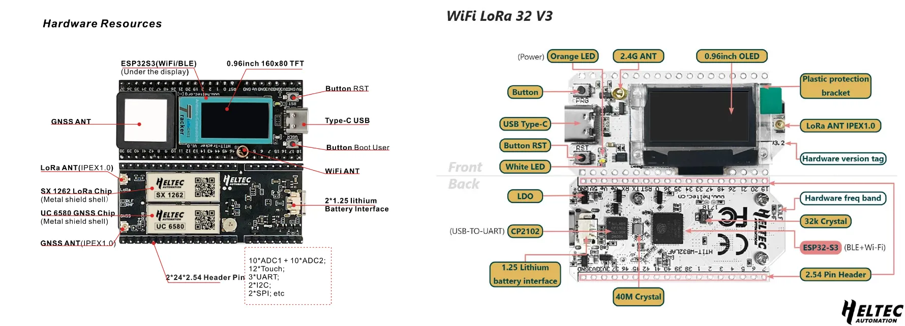



本篇文章评测的 Heltec Wireless Tracker 由 Heltec 官方免费寄送，以供测试与体验。作者并未为此设备支付费用；Heltec 方面并未对文章内容提出任何要求。

文章观点均基于作者的真实使用体验。本评测未在发布前提供给 Heltec 审阅，所有观点均独立形成。



在技术社区中，许多新手对 LoRa 和 Meshtastic 充满兴趣，但当他们真正开始上手时，却往往会遇到门槛过高的问题，比如：需要焊接，而自己又没什么焊接经验，担心弄坏设备；接线复杂，一堆模块和跳线让人眼花缭乱。结果就是，很多人买了设备，但最终放弃了。

对于新手来说，最重要的不是“功能强大”，而是“能顺利上手”。一款真正适合新手的设备，应该接近开箱即用，无需额外焊接和复杂配置，让用户可以快速体验到 Meshtastic 的乐趣，而不是被折腾得焦头烂额。

在我们中国社区中，Heltec LoRa32 V3（俗称 Heltec V3）一直是最受欢迎的入门开发板之一。现在有一款功能更完整、上手更简单的设备——Heltec Wireless Tracker，它可以作为 LoRa32 V3 之外的另一种选择。

相比 Heltec V3，它不仅具备所有相同的功能，还额外集成了 GPS 模块，实现开箱即用，无需额外接线或焊接，更不用手动配置 GPS 的引脚。这让它成为目前较为适合新手入门的 Meshtastic 设备之一。

## Heltec Wireless Tracker 的亮点

这款设备集成了 LoRa 通信和 GNSS 定位，并采用了低功耗设计，适合长期运行。

- 核心配置：ESP32-S3FN8 + SX1262 + UC6580，支持 LoRa、Wi-Fi、蓝牙和 GNSS 定位。
- GNSS 多系统支持：兼容 GPS、GLONASS、北斗（BDS）、Galileo、NAVIC 和 QZSS，支持 L1 + L5/L2 频段，提高定位精度。
- 低功耗优化：基于 22nm 工艺设计，适合长时间使用。
- 电池管理：自带 SH1.25-2 接口，支持锂电池充放电管理，并能自动切换 USB/电池供电。
- 屏幕升级：配备 0.96 英寸 160×80 TFT 屏幕，相比 Heltec V3 的 128×64 OLED，对比度和分辨率都有提升。
- 一体化设计：所有元器件都已焊接好，无需外接额外模块，即可直接使用。

以下左图为 Heltec Wireless Tracker；右图为 Heltec LoRa32 v3。

对于新手来说，最大的问题往往是如何将各种模块连接到一起，而这款设备则完全省去了这些麻烦：

1. GPS 直接可用——相比 Heltec V3，它内置 GPS，无需外接模块，也不用手动配置 PIN 脚。
2. 零额外焊接——不像某些开发板需要自己焊接屏幕、GPS 模块或电池接口，这款设备所有元件都已经焊接好，即插即用。
3. 天线设计更灵活——设备自带 LoRa 和 GNSS IPEX 天线接口，同时内置 GPS 陶瓷天线，在信号较好时可直接使用，无需外接天线。由于带上了 IPEX 天线接口，需要外接天线的时候，也非常容易。
4. 更清晰的屏幕——相比 Heltec V3 的 OLED 屏幕，这款设备采用 TFT 彩色屏幕，分辨率、对比度均有提升。

简单来说，这是一款真正的开箱即用 LoRa GPS 设备，对小白用户极其友好，同时也适合进阶用户使用。

## 价格

价格方面，Heltec LoRa32 V3 的官方淘宝店售价为 97 元，而 Heltec Wireless Tracker 的售价为 135 元（以文章发布日查询的数据为准）。

Heltec Wireless Tracker 比 LoRa32 V3 贵 38 元，这部分差价换来了更方便的上手体验。但对于动手能力较强的用户，LoRa32 V3 仍然是更具性价比的选择。

对于新手来说，首先，它无需焊接，省去了额外购买电烙铁、焊锡等工具的成本，同时也避免了焊接可能带来的风险和麻烦。其次，设备自带 GPS 配置，无需用户手动折腾设置，大大降低了踩坑的可能性。此外，Wireless Tracker 配备了更高分辨率的 TFT 彩屏，相比 LoRa32 V3 的 OLED 屏幕，视觉体验更加出色。

开箱即用、功能完整，确实能减少新手的折腾时间。对于希望快速上手的用户来说，这部分溢价是否值得，取决于个人对便利性的需求。

## GPS 定位表现如何？  

GNSS 设备常见的痛点之一是首次定位时间过长，而 Heltec Wireless Tracker 的 GPS 表现相当优秀。

在开阔环境下，它能够在 3 分钟内完成 GPS 冷启动（Fix），相比传统 GPS 设备动辄 10 至 15 分钟的首次 Fix 速度，效果不错。一旦完成首次定位，设备的定位更新保持稳定，非常适合用于实时追踪。

此外，内置的 GPS 天线已足以应对大多数使用场景，如果遇到信号较弱的环境，得益于板子上已经带有 GNSS 的 IPEX 外接口，还可以外接高增益 GNSS 天线以提升接收能力。

## Heltec Wireless Tracker 适合谁？

这款设备特别适合以下场景：
- 新手入门 LoRa，无须额外焊接或配置模块，降低学习成本。
- 放车上，作为移动节点，如车辆定位、人员追踪、户外探险。

优点：
✔ 内置 GPS，开箱即用
✔ 支持 LoRa、Wi-Fi、蓝牙，通信能力强。有了 WiFi，节点就能独立地连接互联网的 MQTT 服务器，脱离手机使用
✔ TFT 彩屏，显示效果更好

缺点：
❌ 相较 Heltec V3，功耗略高
❌ GPS 在遮挡环境下首次 Fix 仍需一定时间

## 上手 Heltec Wireless Tracker

### 1. 连接 LoRa 天线（必做）
- 设备上电前，必须先连接 LoRa 天线，否则可能会损坏射频模块。
- GNSS 天线为可选项，设备自带 GPS 陶瓷天线，在空旷环境下已足够使用。

### 2. 刷入 Meshtastic 固件
1. 使用 USB-C 线 连接设备到电脑。
2. 打开浏览器，访问 Meshtastic 网页固件烧录器 [flasher.meshtastic.org](https://flasher.meshtastic.org)。
3. 选择设备型号 Heltec Wireless Tracker V1.1。
4. 选择标记为最新 Stable (Beta) 的 Meshtastic 固件，点击 Flash，等待刷写完成。

刷写完成后，设备会自动重启，并进入 Meshtastic 网络。

### 设备配置：加入 Meshtastic 网络

#### 1. 手机配对
1. 打开 Meshtastic App，点击 “+” 搜索设备。
2. 选择 Heltec Wireless Tracker，输入设备屏幕上的六位数配对码进行绑定。

#### 2. 设定 LoRa 频段和节点名称
1. 进入 设置 > 区域，选择正确的频段：
 - **CN470（中国）**。国内读者请选择这个。
 - EU868（欧洲）
 - US915（北美）
2. 配置节点名称方便识别，并在无线电配置中启用 GPS 模式。
3. 保存设置，设备重启后，开始广播 GPS 位置并加入 Meshtastic 网络。

## 总结：最适合新手的 LoRa GPS 设备

Heltec Wireless Tracker 在 Heltec LoRa32 V3 的基础上做了重要升级，集成 GPS，屏幕更好，完全开箱即用，真正实现了零门槛上手。

Wireless Tracker 在功能整合度和易用性方面确实对新手友好，但仍然取决于个人需求。如果你不介意自己焊接或外接模块，LoRa32 V3 仍然是一个性价比较高的方案。