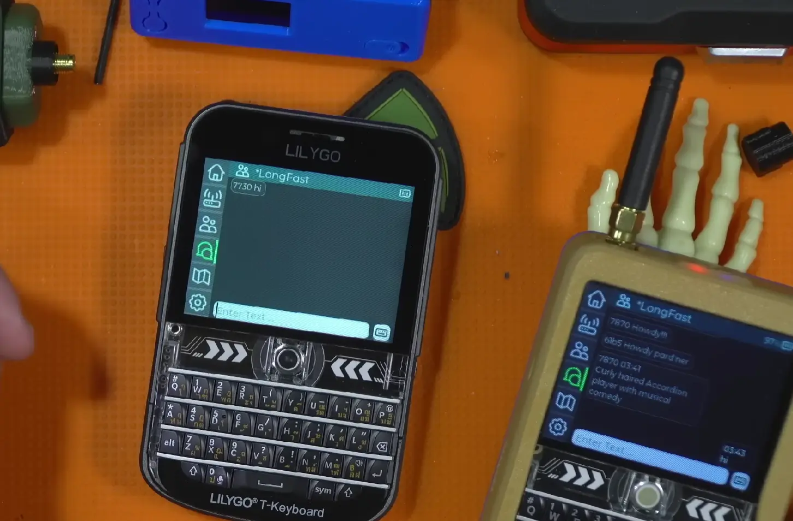

> 以下内容翻译自 Meshtastic 官方博客文章《Meshtastic 2.6 Preview: MUI and Next-Hop Routing are here!》。有兴趣的读者可以阅读 [原文](https://meshtastic.org/blog/meshtastic-2-6-preview/)。

新版本 Meshtastic 2.6 预览版来了！这次更新历时 1.5 年，带来了我们全新的独立设备用户界面——Meshtastic UI（简称 MUI）。此外，我们还推出了一种全新的点对点消息（Direct Messages，DM）路由算法，提升消息传输效率。当然，还有更多惊喜等你发现！我们对这个版本充满期待，这可能是自 2022 年 11 月 Meshtastic 2.0 发布以来，功能最丰富的一次更新。欢迎大家体验并给我们反馈！

## 什么是“预览版”？

该版本为预览版（Preview Release），意味着它尚未准备好作为正式稳定版本发布。可以理解为“预发布版本”或“早期测试版”。我们开放下载的目的是收集社区反馈、发现潜在问题，并在正式发布前进行更全面的测试。

如果你乐于尝鲜，并愿意帮助我们优化最新功能，欢迎试用！如果你希望等到更稳定的正式版，也完全没问题，完整版本即将推出。

## 2.6 版本的核心新功能

### 点对点消息（DM）“Next-Hop”路由

经过近 1.5 年的研究、开发、仿真测试和实际验证，我们很高兴宣布 Meshtastic 现在拥有更高效的点对点消息传输路由。由于该方法完全向后兼容，因此可以逐步更新网络中的设备，更新得越多，收益越大。

我们之前的[博客文章](/why-meshtastic-uses-managed-flood-routing/)曾解释过为什么 Meshtastic 采用“管理式泛洪”路由（Managed Flood Routing），并指出该方法在广播消息中表现优异，但在点对点消息中仍有优化空间。对于广播消息，我们也探索了不同的优化方案（例如[这项提案](https://github.com/meshtastic/firmware/pull/5697)），但在多种拓扑结构下，目前的方法仍然更优，且更改它可能导致兼容性问题。

新“Next-Hop”路由的实现涉及多个优化点，以确保兼容性、减少控制开销、优化内存使用，并适应现实世界的各种情况，比如移动节点、链路不对称、丢包等，特别是在网络负载增加时。

由于 Meshtastic 的未加密数据包头中仍有两个可用字节，我们将其用于记录当前数据包的转发节点（relayer）和“Next-Hop”节点（next-hop）。起初，消息仍会使用管理式泛洪传输，但设备会记录哪些节点成功转发了该数据包。当收到目标设备的响应（如 NodeInfo、确认 ACK、Traceroute 结果等）后，系统会确认是否由先前的转发节点返回。如果是，该节点将被设定为“Next-Hop”节点。这样一来，未来的消息传输过程中，仅匹配“Next-Hop”字节的设备才会转发该消息，而非所有节点都尝试转发。

该策略是逐跳确定的，因此如果某一跳的链路不对称，或者中间存在未升级的旧版设备，则仍会使用管理式泛洪。当设备移动或射频（RF）条件变化时，原“Next-Hop”可能失效。因此，如果在最后一次重传尝试时仍未收到预期的“Next-Hop”转发，设备将回退到管理式泛洪模式。

> 
>
> 点对点消息的“Next-Hop”路由示意图

### Meshtastic UI（MUI）：独立设备的全新体验

历经一年的开发（期间还经历了重大工具链变更），我们终于推出了 Meshtastic UI（MUI）预览版！MUI 是为独立 Meshtastic 设备打造的新界面，提供完整的触摸屏体验，让你无需手机即可操作 Meshtastic 网络。

这个 UI 在过去曾被称为 fancyUI，社区成员曾经写过[文章讲述如何烧录 fancyUI 到 Lilygo T-Deck 尝鲜](/flash-meshtastic-t-deck-fancy-UI/)。Lilygo T-Deck 是一个外观灵感来自黑莓手机的酷炫产品，带有小物理键盘、轨迹球以及 LoRa 通信能力。

该项目投入了 12 个月的开发，编写了 12,000 行手写代码和 50,000 行自动生成代码，并成功移植到 10 款不同设备上。此外，MUI 已被翻译成 18 种语言，让全球用户都能轻松使用。

尽管 MUI 取得了重要进展，但仍在不断完善中。我们正努力添加更多功能，优化性能，让体验更加流畅。

#### 支持设备

MUI 兼容以下设备：

- **带 ESP32-S3 和 TFT 显示屏的独立 LoRa 设备**：LilyGo T-Deck、Seeed SenseCAP Indicator、unPhone、PICOmputer、Elecrow 5"/7"（实验性）
- **CYD 风格设备（ESP32-S3 通过串口连接到 LoRa 设备）**：T-HMI、Mesh-Tab、“Replicator”（ESP-4848S040）、Makerfabs 4"
- **嵌入式 Linux 设备（SPI/I2C + GPIO）**：Raspberry Pi、Milk-V、LuckFox（带 TFT SPI 和 LoRa Hat）
- **Linux 本机环境**：PC 运行 Meshstick 或 SIMRadio，使用 X11 MUI

#### 主要功能

- **仪表盘界面** - 显示设备状态，包括新消息、节点数量、时间、无线电设置、GPS 状态、Wi-Fi、MQTT 连接等。
- **节点列表** - 查看、筛选和高亮显示网络中的节点。
- **聊天窗口** - 发送和接收消息，支持消息历史记录。
- **动态地图视图** - 平移、缩放并自定义地图样式，方便网络可视化。
- **设备基本配置** - 无需手机即可快速调整基本设置。
- **工具集** - 包含网络扫描仪、信号强度测量、Traceroute、统计数据、数据包日志。
- **蓝牙编程模式** - 可通过蓝牙无线更新和配置设备。

> 
>
> MUI 界面展示：地图视图

MUI 代表了 Meshtastic 在设备端用户界面上的重大进步，带来了更直观、流畅的使用体验。你可以在[Meshtastic Web Flasher](https://flasher.meshtastic.org/)中选择“Meshtastic UI”选项来刷写。

## 立即尝试 Meshtastic 2.6 预览版

🚨 **刷写 2.6 预览版会清除设备数据，请务必备份你的配置和密钥！** 🚨

我们特意为该版本增加了一点“小门槛”，以防止用户误刷固件。在[Meshtastic Web Flasher](https://flasher.meshtastic.org/)中刷写时，你需要输入一个**特殊代码**才能解锁。

提示如下：

> 
>
> **想要刷写新固件？回忆经典游戏秘籍，输入传奇代码解锁！**

我们期待你的体验反馈！

## 反馈建议

如果你在使用 Meshtastic 2.6 预览版过程中遇到问题、有疑问或想分享想法，欢迎加入我们的[Discord 频道](https://discord.gg/9Z2jgJb)或[Reddit 社区](https://www.reddit.com/r/meshtastic/)。你的反馈对我们至关重要，将帮助我们改进正式版本。感谢你成为 Meshtastic 社区的一员！

