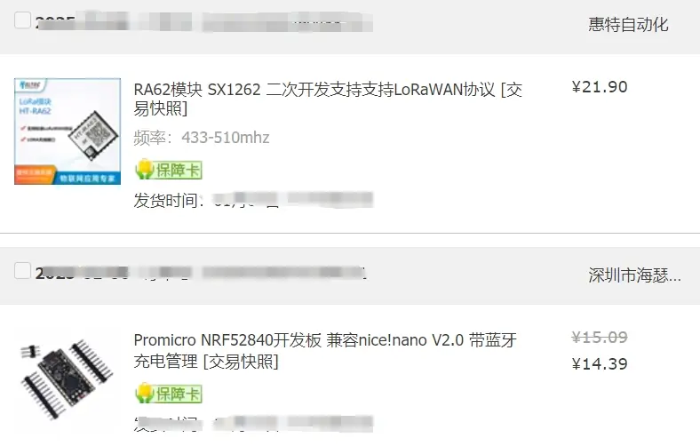
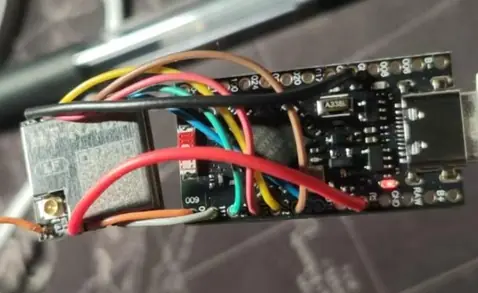

> 投稿来自 [社区群](/contact) 成员 *重庆-BG8HVK*。谢谢作者的耐心整理和无私分享。

## 编者按

在物联网和低功耗无线通信的时代，DIY 自制 LoRa 节点已经成为技术爱好者探索和实践的重要方向。

本文将以 nRF52 开发板和 SX1262 模块为基础，详细讲解如何手动打造一个 Meshtastic 节点。通过焊接、刷入固件和配置的全过程，不仅能深入理解硬件与通信协议的结合，还能体验 DIY 的乐趣与挑战。

如果你正在寻找一份完整的指南，帮助你从零开始搭建自己的 LoRa 网络，这篇文章将是你理想的起点。

如果你不具备飞线的技术，只想用一些现成的工具，但又希望保留一点 DIY 的乐趣，可以关注 MeshCN 社区其他文章，比如关于 fakeTec 项目的介绍，它通过 PCB 替代飞线，让你轻松实现同样的功能。

## 一、购买器材

1. nRF52840 开发板 1x
2. LoRa 模块 SX1262（建议带温补晶振，我选的 Heltec 的 HT-RA62）1x

💴 合计成本 35 块人民币。

> **编者注**
> SX1262 是 Semtech 公司生产的一款 LoRa 芯片，相当于发动机，提供了核心通信能力；而 HT-RA62 则是 Heltec 基于 SX1262 打造的完整模块，集成了 SX1262 和必要的外围电路（如电源管理和天线接口），就像在发动机的基础上装配了车架、电池和轮胎，变成了一辆可以直接使用的汽车。
> 开发者无需自行设计硬件，只需「驾驶汽车」，即可轻松实现 LoRa 通信。
> 
> 至于温度补偿晶振（TCXO），选择带 TCXO 的 LoRa 模块对于 Meshtastic 的太阳能节点或户外节点至关重要，因为这些设备通常暴露在温差较大的环境中（如白天高温与夜晚低温）。TCXO 能自动补偿温度引起的频率漂移，确保在远距离通信中保持稳定的信号质量和可靠性。



## 二、根据线路图焊接

参考这个 nRF52 开发板 Pro-Micro [原理图](https://github.com/meshtastic/firmware/blob/master/variants/diy/nrf52_promicro_diy_tcxo/Schematic_Pro-Micro_Pinouts%202024-12-14.pdf) 完成焊接。

RA62 模块如下：


焊接完成后的实物展示如下：



> **编者注** 
> 这个飞线很 [焊武帝](/announcement-2024-last-day-annual/#三、焊武帝的崛起与-DIY-热潮) 啊！如果你不是焊武帝的话，不妨关注一下 fakeTec 项目。它的材料和原理与这套飞线设计基本一致，但把飞线替换成了一个简单的 PCB 板，这样你就不需要高超的飞线技术，也能轻松 DIY 成功了！

## 三、刷固件/烧录过程

### 1. 刷 Bootloader

首先，您需要下载和安装相关工具，并将设备置于刷机模式以进行 Bootloader 的更新。

#### 下载和准备

从 [Adafruit nRF52 Bootloader](https://github.com/adafruit/Adafruit_nRF52_Bootloader?tab=readme-ov-file) 下载 `nice_nano_bootloader-0.9.2_s140_6.1.1.zip`。

确保 Python 已安装并正确配置。通过终端运行以下命令安装 `adafruit-nrfutil` 模块：

```bash
pip install adafruit-nrfutil
```



如何检查 Python 是否已正确安装并添加到系统环境变量？

打开终端（在 Windows 系统中，按 Win + R 输入 `cmd` 打开命令提示符），运行以下命令：
`python --version`  
`pip --version`  

如果未能正确显示版本号，请检查 Python 的安装情况，或者手动将 Python 路径添加到环境变量。

如何添加环境变量方法（Windows 系统）? 

进入「设置」 → 「系统」 → 「关于」 → 「高级系统设置」 → 「环境变量」，在「系统变量」中编辑 `Path`，添加 Python 的安装路径，例如 `C:\Python39\`。具体路径取决于你的电脑 Python 安装路径，请勿照搬我这个例子。

```bash
# 检查 Python 和 pip 的版本
python --version
pip --version
```




#### 刷机步骤

1. 将设备短接 RST 和 GND 两下，进入刷机模式（设备会显示为一个可移动盘符）。
2. 打开终端，进入 `nice_nano_bootloader-0.9.2_s140_6.1.1.zip` 所在的目录。
3. 使用以下命令刷入 Bootloader（具体命令根据操作系统和设备端口调整）：

   **通用命令格式**：
   ```bash
   adafruit-nrfutil dfu serial -pkg <bootloader.zip> -p <设备端口>
   ```

#### 示例操作

- **Windows 系统**  
  假设设备端口为 `COM11`：
  1. 在 `nice_nano_bootloader-0.9.2_s140_6.1.1.zip` 所在文件夹中按住 `Shift` 键，右键空白处，选择「在此处打开终端」。
  2. 执行以下命令：  
     ```bash
     adafruit-nrfutil dfu serial -pkg nice_nano_bootloader-0.9.2_s140_6.1.1.zip -p COM11
     ```

- **Linux 系统**  
  假设设备端口为 `/dev/ttyUSB0`：
  ```bash
  adafruit-nrfutil dfu serial -pkg nice_nano_bootloader-0.9.2_s140_6.1.1.zip -p /dev/ttyUSB0
  ```

  或者 `/dev/tty.usbmodem21201`：
  ```bash
  adafruit-nrfutil dfu serial -pkg nice_nano_bootloader-0.9.2_s140_6.1.1.zip -p /dev/tty.usbmodem21201
  ```

### 2. 刷入 nrf_erase2.uf2

1. 在固件下载页面 [Meshtastic Firmware](https://mrekin.duckdns.org/flasher/) 中找到适配的擦除固件（例如 `Meshtastic_nRF52_factory_erase_v3_S140_7.3.0.uf2` 或 `Meshtastic_nRF52_factory_erase_v3_S140_6.3.0.uf2`）。  
   根据 SoftDevice 主版本号选择对应文件：
   - 7.x.x：使用 `Meshtastic_nRF52_factory_erase_v3_S140_7.3.0.uf2`。
   - 6.x.x：使用 `Meshtastic_nRF52_factory_erase_v3_S140_6.3.0.uf2`。
2. 将设备短接 RST 和 GND 两下，进入刷机模式（设备会以可移动盘符形式显示）。
3. 将 `nrf_erase2.uf2` 文件拷贝到该移动盘符，等待设备自动重启。

### 3. 刷入 Meshtastic

1. 打开 [固件下载页面](https://mrekin.duckdns.org/flasher/)，选择 `nrf52_promicro_diy`，下载 `nrf52_promicro_diy_tcxo-v2.5.19.33e5a045.daily.uf2`。
2. 连续快速短接 RST 和 GND 两下进入刷机模式，出现移动盘符，将 `*.uf2` 文件拷贝到移动盘中，等待设备自动重启。

### 4. 设置 Meshtastic

您可以选择以下两种方式设置：
- 通过 Web 模式：使用 [client.meshtastic.org](https://client.meshtastic.org) 连接串口进行设置。
- 通过手机 App：使用 App 连接蓝牙进行设置，默认 PIN 为 `123456`。

> **编者注**
> 如果你的 Meshtastic 设备在没有屏幕的情况下刷入固件，它会自动默认蓝牙配对 PIN 为 「123456」。这正是本文的情况。
> 但如果设备曾经连接过屏幕并开机，那么配置会变成随机 PIN，即使后来屏幕被移除，这个随机 PIN 配置仍会保留。要解决这个问题，可以通过 Web Client 或 Meshtastic 手机 App 将配置改为使用默认 PIN，或者通过恢复出厂设置，下次开机后 PIN 会重新变为 「123456」。
> 记得根据实际情况选择合适的方式哦！