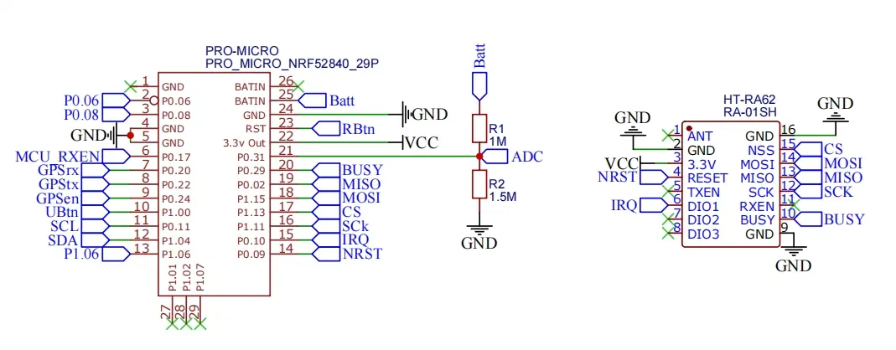

> 投稿来自 [社区群](/contact) 成员 *重庆-BG8HVK*。谢谢作者的耐心整理和无私分享。

## 编者按

在物联网和低功耗无线通信的时代，DIY 自制 LoRa 节点已经成为技术爱好者探索和实践的重要方向。

本文将以 nRF52 开发板和 SX1262 模块为基础，详细讲解如何手动打造一个 Meshtastic 节点。通过焊接、刷入固件和配置的全过程，不仅能深入理解硬件与通信协议的结合，还能体验 DIY 的乐趣与挑战。

如果你正在寻找一份完整的指南，帮助你从零开始搭建自己的 LoRa 网络，这篇文章将是你理想的起点。

如果你不具备飞线的技术，只想用一些现成的工具，但又希望保留一点 DIY 的乐趣，可以关注 MeshCN 社区其他文章，比如关于 fakeTec 项目的介绍，它通过 PCB 替代飞线，让你轻松实现同样的功能。

## 一、购买器材

1. nRF52840 开发板 1x
2. LoRa 模块 SX1262（建议带温补晶振，我选的 Heltec 的 HT-RA62）1x

💴 合计成本 35 块人民币。

> **编者注**
> SX1262 是 Semtech 公司生产的一款 LoRa 芯片，相当于发动机，提供了核心通信能力；而 HT-RA62 则是 Heltec 基于 SX1262 打造的完整模块，集成了 SX1262 和必要的外围电路（如电源管理和天线接口），就像在发动机的基础上装配了车架、电池和轮胎，变成了一辆可以直接使用的汽车。
> 开发者无需自行设计硬件，只需“驾驶汽车”，即可轻松实现 LoRa 通信。
> 
> 至于温度补偿晶振（TCXO），选择带 TCXO 的 LoRa 模块对于 Meshtastic 的太阳能节点或户外节点至关重要，因为这些设备通常暴露在温差较大的环境中（如白天高温与夜晚低温）。TCXO 能自动补偿温度引起的频率漂移，确保在远距离通信中保持稳定的信号质量和可靠性。


## 二、根据线路图焊接

参考这个 nRF52 开发板 Pro-Micro [原理图](https://github.com/meshtastic/firmware/blob/master/variants/diy/nrf52_promicro_diy_tcxo/Schematic_Pro-Micro_Pinouts%202024-12-14.pdf) 完成焊接。

RA62 模块如下：



焊接完成后的实物展示如下：


> **编者注** 
> 这个飞线很 [焊武帝](/announcement-2024-last-day-annual/#三、焊武帝的崛起与-DIY-热潮) 啊！如果你不是焊武帝的话，不妨关注一下 fakeTec 项目。它的材料和原理与这套飞线设计基本一致，但把飞线替换成了一个简单的 PCB 板，这样你就不需要高超的飞线技术，也能轻松 DIY 成功了！

## 三、刷固件/烧录过程

### 1. 刷 Bootloader

1. 打开 [Adafruit nRF52 Bootloader](https://github.com/adafruit/Adafruit_nRF52_Bootloader?tab=readme-ov-file) 下载 `nice_nano_bootloader-0.9.2_s140_6.1.1.zip`。
2. 在 Python 下安装 `adafruit-nrfutil` 模块：

   ```bash
   pip install adafruit-nrfutil
   ```

3. 通过以下命令刷入 Loader：
   - **Windows 10** 下（假设串口为 COM11）：

     ```bash
     adafruit-nrfutil dfu serial -pkg nice_nano_bootloader-0.9.2_s140_6.1.1.zip -p COM11
     ```

   - **Linux** 下：

     ```bash
     adafruit-nrfutil dfu serial -pkg nice_nano_bootloader-0.9.2_s140_6.1.1.zip -p /dev/tty.usbmodem21201
     ```

### 2. 刷入 Meshtastic

1. 打开 [固件下载页面](https://mrekin.duckdns.org/flasher/)，选择 `nrf52_promicro_diy`，下载 `nrf52_promicro_diy_tcxo-v2.5.19.33e5a045.daily.uf2`。
2. 连续快速短接 RST 和 GND 两下进入刷机模式，出现移动盘符，将 `*.uf2` 文件拷贝到移动盘中，等待设备自动重启。

### 3. 设置 Meshtastic

您可以选择以下两种方式设置：
- 通过 Web 模式：使用 [client.meshtastic.org](https://client.meshtastic.org) 连接串口进行设置。
- 通过手机 App：使用 App 连接蓝牙进行设置，默认 PIN 为 `123456`。

> **编者注**
> 如果你的 Meshtastic 设备在没有屏幕的情况下刷入固件，它会自动默认蓝牙配对 PIN 为 “123456”。这正是本文的情况。
> 但如果设备曾经连接过屏幕并开机，那么配置会变成随机 PIN，即使后来屏幕被移除，这个随机 PIN 配置仍会保留。要解决这个问题，可以通过 Web Client 或 Meshtastic 手机 App 将配置改为使用默认 PIN，或者通过恢复出厂设置，下次开机后 PIN 会重新变为 “123456”。
> 记得根据实际情况选择合适的方式哦！