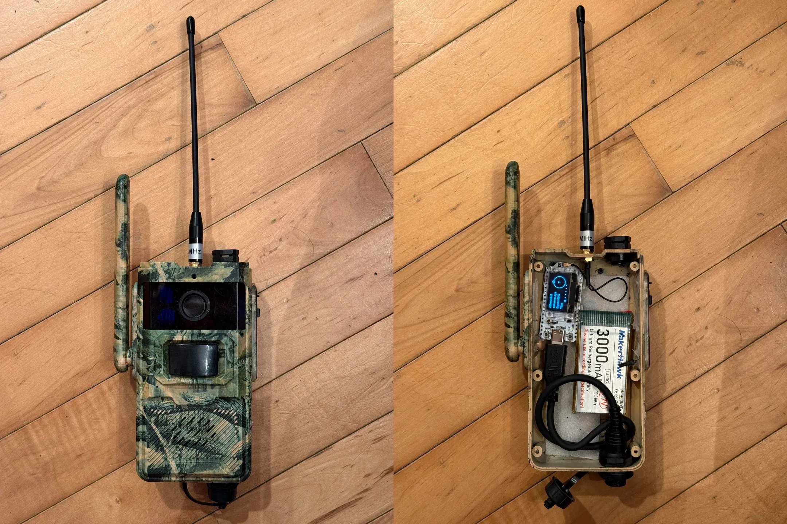

祝大家情人节快乐。今天分享一个迷彩节点案例。

原作者 *outbackhiker* 将一台废弃的 trail camera 监控摄像头拆解，重新组装，变身为一款隐蔽的 Meshtastic 节点。这不仅仅是一个硬件改造，更是对设备工作原理的巧妙运用。

## 项目的灵感：伪装与功能的双重挑战

这个 Meshtastic 节点的最大特点就是外壳的迷彩设计。传统的节点设计通常直接暴露出硬件部分，而原作者则选择了一款废弃的监控摄像头外壳，将其改造成一个外形隐蔽且功能完整的节点。这种设计不仅确保了设备能够在户外环境中悄然运行，而且提升了设备的隐蔽性，避免了被意外损坏的风险。

为了让节点在伪装的同时仍然具有强大的性能，原作者精心选择了以下几款关键组件。

- Gizont 天线：为了确保节点即使放置在隐蔽的地方也能保持稳定的信号传输，使用了 Gizont 家的天线。无独有偶，MeshCN 社区成员群里之前也发现这品牌的天线效果比较好。
- Trail camera（打猎镜头/踪跡相機）摄像头外壳：作为伪装的核心部分，摄像头外壳既能防尘防水，又能利用机身的迷彩隐藏设备内部的电子组件，达到美观与实用的完美平衡。
- Li-ion 锂聚合物电池：使用了一个可靠的 Li-ion 电池，提供足够的电力以支持设备持续运行。根据原作者的反馈，尽管这个电池能够在一定时间内供电，但 Heltec 模块的电池续航仍然存在问题，最多只能维持两天的使用时间。他因此计划换用更高效的 RAK 模块。

在这个项目中，*outbackhiker* 还特别加入了通风阀（air breath vent）。这一看似不起眼的小配件，实际上对设备的长期稳定性至关重要。在封闭的外壳中，设备在长期运行时会因为温度变化或湿度增高而导致内部水分凝聚，从而结露，影响电子元件的正常工作。通风阀的设计能够有效避免这种情况，帮助内部保持干燥，并避免水分对电池和电路板的腐蚀。

通风阀的原理基于气体的流动，在保持防水的同时，确保外部空气进入设备时不会让水分积聚。通过这点，设备能够保持在一个健康的工作环境中，延长其使用寿命。

## 续航挑战

在这个项目中，*outbackhiker* 遇到的一个主要问题就是 Heltec LoRa32 v3 模块的电池续航。由于该模块基于高功耗的 ESP32 芯片，它的能耗较高，导致电池只能支撑约两天的工作时间。这也是他决定将 Heltec 模块替换为 RAK 模块的原因之一。

RAK 模块与 Heltec T114 模块相似，两者采用的都是低功耗的 nRF52 MCU。这种 MCU 在低功耗模式下表现非常出色，可以大大延长电池使用时间。特别是在太阳能供电的情况下，低功耗设计至关重要，可以确保设备在长时间不充电的情况下依然能够稳定工作。

因此，原作者打算用 RAK 模块替代 Heltec 模块，以便充分利用低功耗特性，提升设备的续航能力。

我们 MeshCN 社区也发现了 nRF52 MCU 作为太阳能节点的优势。因此，Heltec T114 在我们中国 Meshtastic 社区里十分受欢迎。倒不是 RAK 有什么问题，纯属是 Heltec T114 的性价比更高，群友对他的经验也比较充足。

## 结语：从创意到实现，DIY 的无限可能

原作者的这个项目不仅仅是一个简单的设备改装，更是一场充满创意和挑战的 DIY 冒险。他通过精心选择和布置组件，不仅保持了设备的功能性，还充分考虑了伪装与长期稳定性。在设计中注重细节，如通风阀的安装，展现了 DIY 项目中的技术深度和实践智慧。

如果你也对打造属于自己的 Meshtastic 节点感兴趣，不妨从这个案例中汲取灵感。无论是外壳设计，还是电池续航优化，都有无穷的可能等着你去发掘。快来 [加入我们的社区](/contact/)（有微信群哦~），分享你的创意和经验吧！

如果你对这个项目的更多细节和讨论感兴趣，可以访问原始的 [Reddit 讨论帖](https://www.reddit.com/r/meshtastic/comments/1iojumg/its_an_addiction/) 进一步了解。这是一个充满创意和技术挑战的讨论，值得一读。