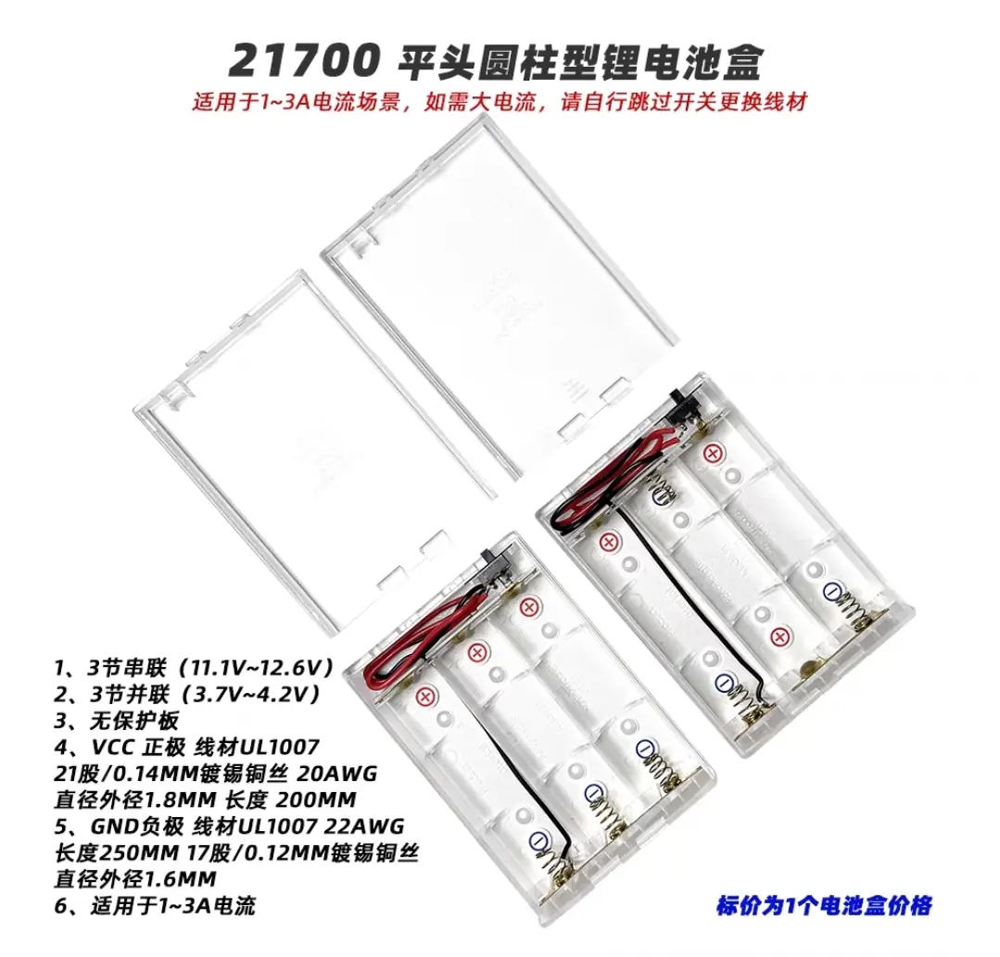
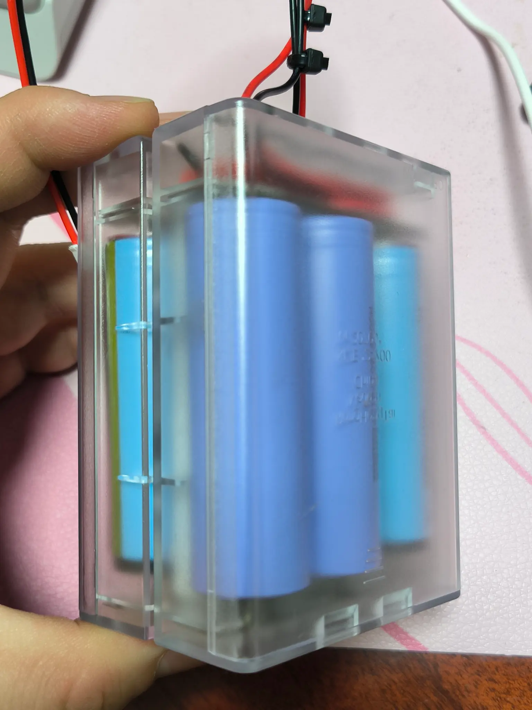
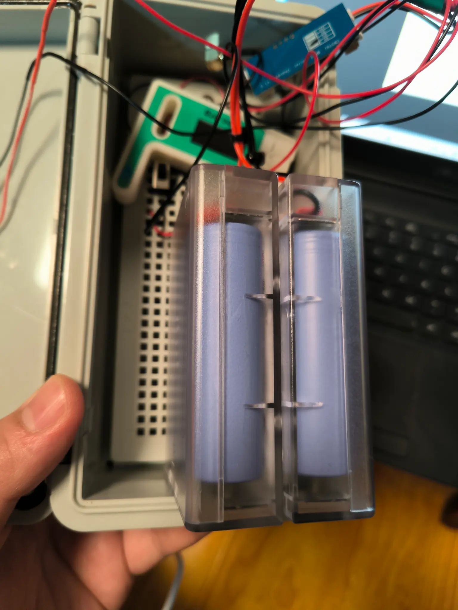
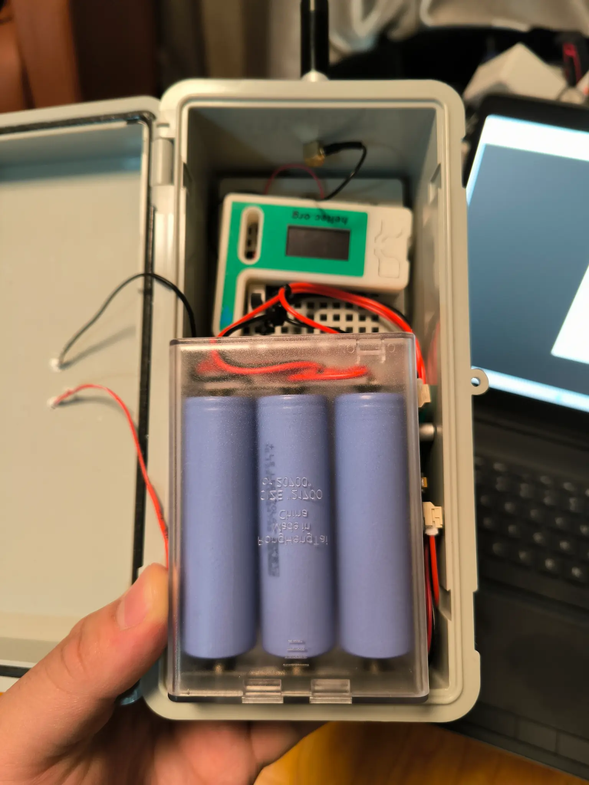

如果你还没看过 *佛系白猫* 之前的《太阳能节点的奇妙旅程》，强烈建议先去看看[原文](/meshtastic-solar-node-case-wrong-18650-21700-battery/)。在那篇文章中，他详细记录了如何一步步踩坑，最终绕过各种电池盒的麻烦，把 18650 电池塞进 21700 电池盒，并成功部署了他的 Meshtastic 太阳能节点。

但故事还没结束。

在升级 Heltec V3 方案时，他又遭遇了一次电池盒的奇葩问题——这次是 21700 电池盒的结构性缺陷。

## 21700 电池盒的坑

他这次组装了两个太阳能节点，一个是 T114 方案，另一个是 Heltec V3 方案。由于 V3 方案的功耗较高，他决定直接在电池盒里塞满 4 节 21700 电池。

但是！

他很快发现，现有的 21700 并联电池盒竟然无法正常工作。

经过仔细排查，发现原因是：21700 并联电池盒内部的触点导线会把平头 21700 电池顶起来，导致部分电池无法接触到电路，结果就是 4 节电池里只有 2 节能用。

更离谱的是，如果他用 18650 电池反而不会出现这个问题。

这种“迷之结构设计”让人一度怀疑这个电池盒到底是不是专门为 21700 设计的……

## 终于找到合适的电池盒！

面对这个问题，他在淘宝上疯狂搜索了好久，终于找到了一款完全合适的电池盒。

这款新电池盒具有以下特点：

- 支持 6 节 21700 电池，可以选配保护板，提供更稳定的电池管理。
- 结构设计合理，不会出现电池被顶起的问题。
- 尺寸刚好可以放进之前用的塑料卡扣户外防水配电箱（200mm x 100mm x 70mm 带底板灰盖），完美适配。

## 新的电池盒安装效果

换上新电池盒后，他的太阳能节点终于可以满负荷运行。

整个电池盒可以完美安装在防水配电箱内，线路布局清晰，接线牢固，不会出现接触不良的问题。

## 经验总结：如何避免踩坑？

如果你也打算在 Meshtastic 太阳能节点中使用 21700 电池，有几个关键点需要注意。

首先，务必选择结构合理的电池盒，确保触点不会将平头电池顶起，同时要选择支持并联连接的电池盒，否则串联电池盒可能会导致电压过高。

其次，检查电池盒的尺寸是否匹配你的设备箱体。如果你也使用塑料卡扣户外防水配电箱（200mm x 100mm x 70mm），那么这款新电池盒是一个非常合适的选择。

此外，需要考虑是否需要保护板。如果电池盒本身没有保护板，建议使用带保护板的 21700 电池，以防止过充或过放，确保系统长期稳定运行。

## 结语

DIY 太阳能节点的乐趣就在于不断探索、不断升级，*佛系白猫* 这次又成功解决了一个关键问题，终于让 21700 电池盒真正发挥作用。

如果你也在折腾 Meshtastic 太阳能节点，欢迎加入我们 [Meshtastic 中国社区](https://meshcn.net/contact/)，一起交流更多有趣的 DIY 经验！

📌 相关链接：
- [前文：折腾太阳能节点的奇妙旅程](/meshtastic-solar-node-case-wrong-18650-21700-battery/)
- [快来抄作业！我的极简 Meshtastic 太阳能节点](/meshtastic-solar-node-build-simple-sma-antenna-t114/)



## 电池盒避坑

*佛系白猫*一共做了两个太阳能节点，一个是T114方案，另一个是Heltec V3方案。V3方案耗电太快，所以*佛系白猫*在电池盒里直接装了4节27100电池，然后他发现正在用的21700电池盒有缺陷：21700并联电池盒内部触电的导线会把平头的21700电池顶起来（搞笑的是如果用18650电池就不会）导致两个电池盒只有2节电池能用，另外两节不通。

所以他在网上找了好久，终于找到了一款非常合适的电池盒，并且可以完美的放进塑料卡扣户外防水配电箱200mm x 100mm x 70mm【带底板灰盖】里，而且可选带保护板（使用6节21700）



