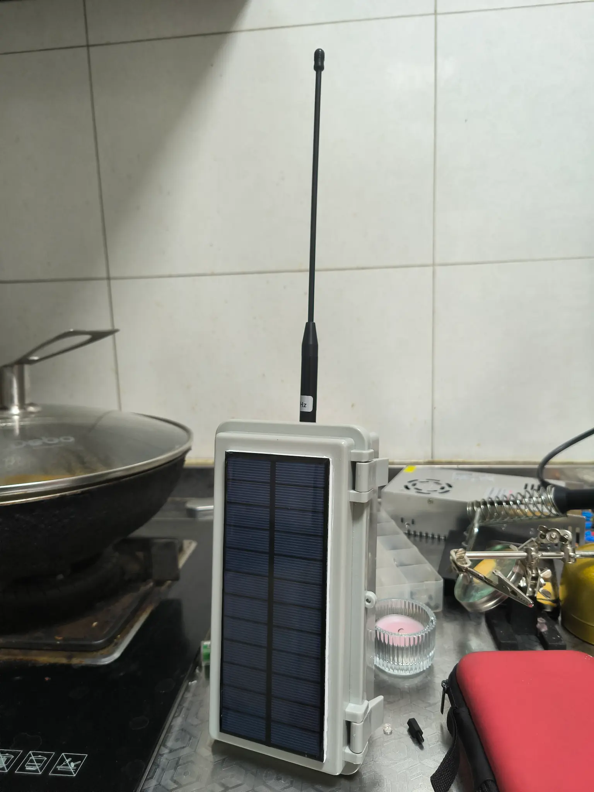
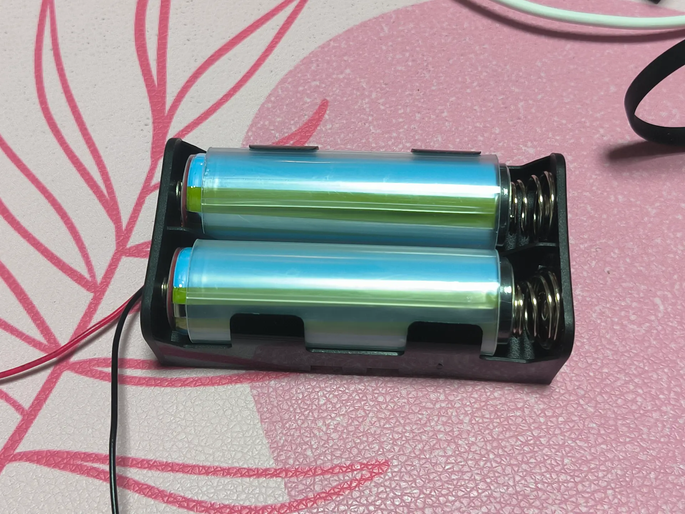
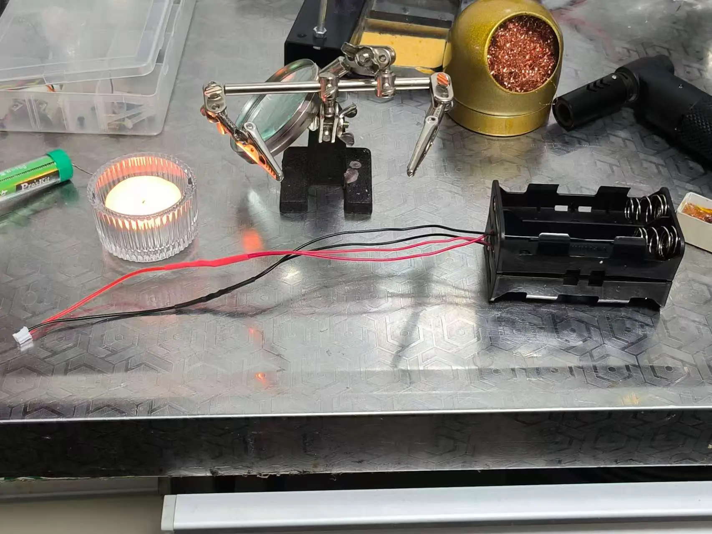
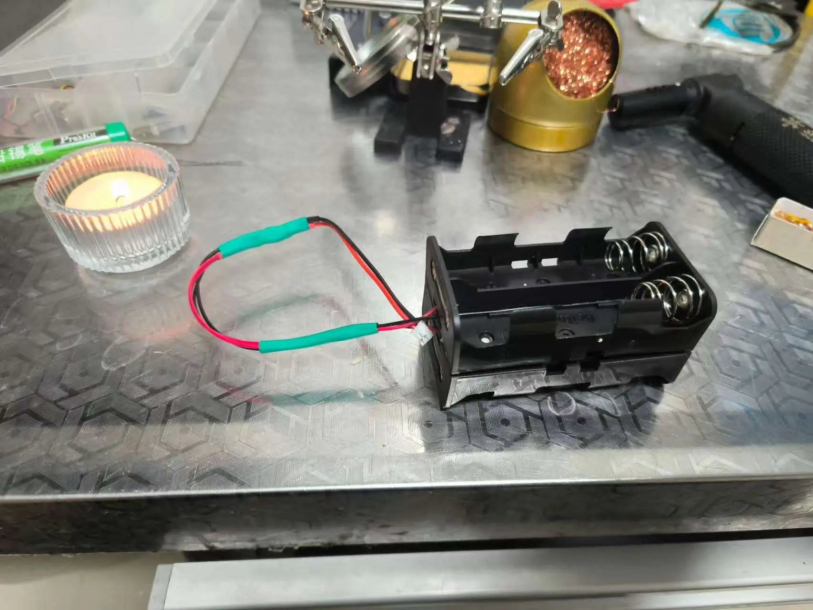
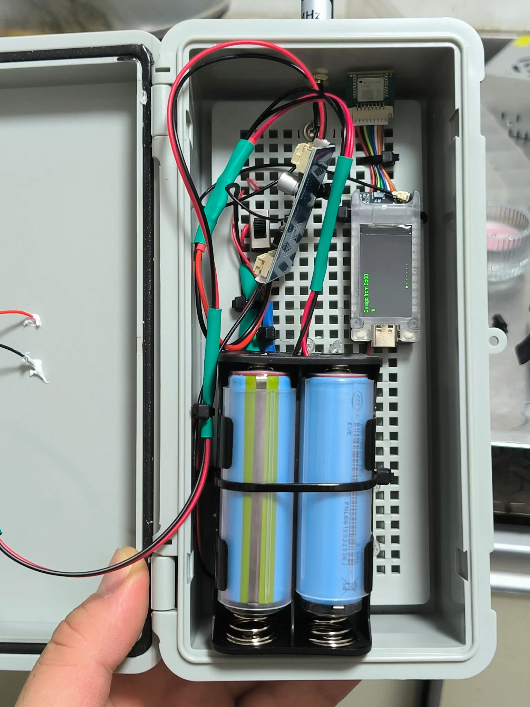

如果你认为 DIY 是一件简单的事，那一定是还没听说*济南-佛系白猫*的 Meshtastic 装机（Meshtastic build）故事。

> 所有的欢乐都伴随着痛苦，而所有的痛苦又孕育着新的欢乐。

这位社区活跃分子，按照之前的《[快来抄作业！我的极简 Meshtastic 太阳能节点](/meshtastic-solar-node-build-simple-sma-antenna-t114/)》指南制作了自己的 Meshtastic 太阳能节点，虽然结果喜人，但整个过程绝对堪称一出「技术喜剧」。

接下来，让我们一起看看他的故事。

## 佛系白猫的基本配置

*佛系白猫*的 Meshtastic Build 和指南中的设计相似，依然采用了 Heltec T114 和 18650 锂电池。

| 序号 | 材料名称                               | 型号及描述                                           | 价格（大概）      |
|------|----------------------------------------|----------------------------------------------------|-----------|
| 1    | 塑料卡扣户外防水配电箱                 | 200mm x 100mm x 70mm【带底板灰盖】                              | ¥14    |
| 2    | Gizont 433/915MHz 高增益软鞭天线       | 470-510MHz / 24厘米                                  | ¥20   |
| 3    | 18650 电池盒锂电池串并联带              | 18650 4节带线 并联（必须是并联，而不是串联）          | ¥4     |
| 4    | 太阳能单晶多晶滴胶 PET 层压板          | 165*65mm 6V 250mA 滴胶多晶（加了三毛钱多买了两根线） | ¥13    |
| 5    | Heltec T114                            | 建议带 GPS （又称 GNSS）模块购买。GPS 模块可以作为授时工具。     | ¥200-300   |
| 6    | IPEX 转 SMA 连接线                            | SMA外螺内孔转IPEX 1代     | ¥1-2   |
| 7    | 18650 电池                            | 买大品牌的。如果有选择，选带有保护板的     | ¥5-15/每颗（范围很大，取决于容量和品牌）   |

他在指南的基础上增加了一个 MPPT CN3791 控制板，这个升级让太阳能充电效率得到了质的提升。除此之外，其他组件基本与原文一致。可以说，这是一次「有参考但有创新」的 DIY 之旅。

详细材料清单可以参考之前写的 [T114 太阳能节点文章里](/meshtastic-solar-node-build-simple-sma-antenna-t114/)。

不过，故事的真正亮点并不在于组件，而是在他与电池斗智斗勇的过程中。

## 和电池的「持久战」

### 第一回合：错买串联电池盒

按照 [Meshtastic 太阳能节点指南](/meshtastic-solar-node-build-simple-sma-antenna-t114/) 的要求，太阳能节点需要一个 18650 并联电池盒来满足 T114 对 3.7V 电压的需求。然而，串联电池盒的输出电压会直接叠加到 7.4V，这显然超出了 T114 的安全范围。*佛系白猫*在采购时没有注意到这个区别，买到了错误的串联电池盒。

结果可想而知，测试时发现设备无法正常启动，甚至可能损坏电子元件。所幸，他及时发现问题并避免了进一步的故障。这场意外直接让他的电池盒计划推迟了一周。

### 第二回合：保护板带来的麻烦

*佛系白猫*决心吸取教训，第二次采购时特意检查了是并联电池盒。然而，这一次的问题出在电池上。他购买的 18650 电池自带保护板，导致电池长度增加，无法顺利装入电池盒。

由于保护板通常会增加几毫米的长度，这使得标准 18650 电池盒无法容纳这些电池。他尝试了各种调整方法，依然无果。

### 第三回合：卖家的「乌龙」

第三次尝试本以为是万无一失了，他仔细确认买的是 18650 并联电池盒，结果卖家居然又「神助攻」了一把。这次寄来的电池盒竟然还是串联的，*佛系白猫*差点怀疑人生。

这不仅浪费了时间，也让他对供应链的可靠性产生了些许无奈。但他并没有放弃，而是继续寻找解决方案。群友不禁打趣：「你是不是得罪了电池之神？🤣」。

### 第四回合：曲线救国

连续三次的失败没有让他放弃，他选择了一个「曲线救国」的办法——干脆放弃标准的 18650 电池盒。他给自带保护板的 18650 电池加了一个塑料套管，让它尺寸上升级成 21700 电池，然后换用了一个 21700 电池盒。

通过这种方式，他成功绕过了保护板导致的尺寸问题，最终让节点通电成功。

DIY 真是让人又爱又恨！

### 并联电池盒的小插曲

为了进一步提升设备的电池容量，他购买了两个电池盒，每个电池盒可以装两颗电池，也就是最终可以并联四颗 18650 电池。他很快意识到，将两个电池盒的正负极并联在一起是一个新的挑战。

于是，他在社区群里发问：「大佬们，请问1根线接2根线怎么焊接？」（怎么把两个电池盒的线接到一起，这样才能接入到 MPPT 板子的电池口上）

热心群友们纷纷传授经验：

> 一般是你把线剪开，然后把里面的铜线捆在一起
> 然后上锡
> 然后拿热缩管或者胶带封住

他按照大家的建议操作，但聪明地增加了一点自己的创新。他将焊接工作放在厨房的抽油烟机下方进行，这样焊锡时产生的烟味可以直接被厨房烟罩的烟道排出，不需要额外购买和安装排烟设备。

最终，他成功将两个电池盒并联在一起，并确保了每根连接线的焊点牢固而整洁。

## 升级亮点：MPPT 模块

*佛系白猫*的 Build 中还特别增加了 CN3791 MPPT 模块，这一点要点赞。MPPT（最大功率点追踪）模块[能够优化太阳能板的充电效率](/T114-solar-panel-requirement-calculate/)，尤其是在光照条件不理想时表现更佳。

这与指南中的优化建议不谋而合，甚至可以说是将指南中提到的「未来改进」提前实现了。

加了 MPPT 模块后，太阳能板的效率提高了不少。原本有阴影的时候，充电效率会断崖式下降，现在即便是阴天也能保持充电稳定。

## 最终成果

尽管在电池部分经历了无数波折，*佛系白猫*的节点最终还是顺利完成。他把节点部署在家里的阳台上，配备了高增益天线和太阳能板，整体运行稳定，耗电量低。

相信对他来说，DIY 虽然累，但能看着自己的设备稳稳运行，那种成就感是无可替代的。

他的故事是 Meshtastic DIY 的一个缩影，它告诉我们：DIY 不仅仅是动手实践，更是一场充满未知的冒险。虽然可能会遇到各种问题，但只要坚持下去，总能找到解决的办法。

如果你也有类似的有趣故事，欢迎[来 Meshtastic 社区投稿分享](/meshcn-blog-call-for-articles/)！我们非常期待看到更多充满个性和创造力的 DIY 作品。

[加入 Meshtastic 中国社区微信群](/contact/)：和其他用户一起探索更多可能性！

