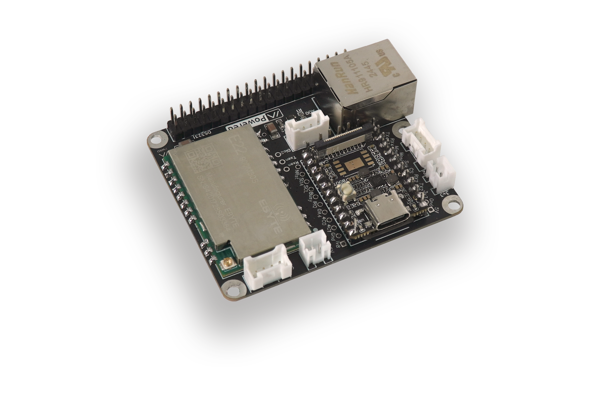
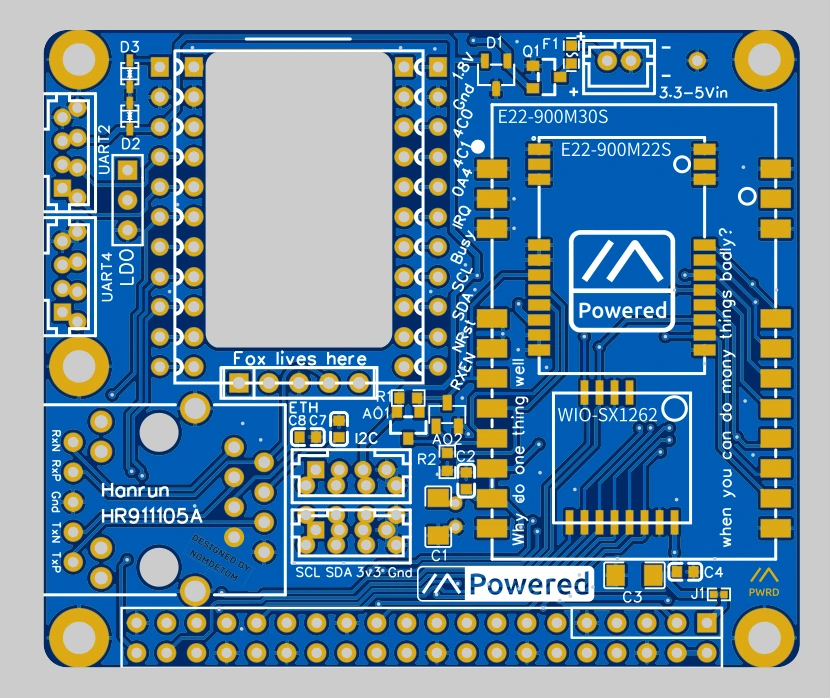

在 Meshtastic 生态中，ESP32 和 nRF52 等嵌入式设备长期以来占据主导地位。这些微控制器架构的节点体积小、功耗低，适合用于长时间运行的 LoRa 自组网。然而，嵌入式系统的局限性也逐渐显现，例如有限的计算能力、较为复杂的配置方式，以及在图形界面、中文输入、网络管理等方面的先天不足。  

如果你想要一个既能运行 Meshtastic，又能提供完整 Linux 体验的设备，该怎么办？这正是 Femtofox 诞生的意义！  

Femtofox 是一款基于 Linux 的 Meshtastic 硬件，支持完整的 Ubuntu 桌面环境，并具备 LoRa 通信能力。相较于传统的嵌入式方案，它能提供更高的计算能力、更丰富的扩展接口，并且具备 SSH 远程管理、中文输入法支持等诸多优势。更重要的是，它仍然保持了低功耗特性，能够轻松运行在太阳能供电系统上。  

在接下来的内容中，我们将深入了解 Femtofox 的硬件架构、操作系统特性、使用场景，以及它如何改变 Meshtastic 网络的可能性。如果你曾希望在 Meshtastic 网络中引入更强大的计算能力，Femtofox 或许就是你一直在等待的答案。  

让我们一起探索这款 Meshtastic 进入 Linux 时代的创新设备！  

## Femtofox：Linux 版 Meshtastic 硬件

在 Meshtastic 生态系统中，ESP32 和 nRF52 等微控制器设备的最大优势在于低功耗和高效能，但它们也有明显的局限性。由于这些芯片的计算能力有限，运行 Meshtastic 仅能通过微控制器的方式进行，所有数据处理、用户交互和网络管理都必须通过相对受限的 MCU 端代码完成。这使得 Meshtastic 在使用过程中面临以下挑战：  

- 配置不便：需要依赖手机或电脑进行蓝牙/WiFi 配置，缺乏直观的本地管理界面。  
- 功能受限：无法直接运行复杂应用，如 Web 服务器、远程管理工具或脚本任务。  
- 扩展性不足：不支持标准 Linux 生态的 USB 设备、网络服务、脚本自动化等功能。  

Femtofox 作为一款运行完整 Linux 系统的 Meshtastic 设备，弥补了这些短板。它不仅保留了 LoRa 低功耗无线通信能力，还提供了一个全功能的计算环境，让 Meshtastic 节点的可玩性和可扩展性达到了新的高度。

### Femtofox 硬件概览


Femtofox 的核心是一块基于 Rockchip RV1103 处理器的计算板，它的规格如下：  

| 组件        | 规格说明 |
|-- |--|
| 处理器 | Rockchip RV1103（Cortex-A7 1.1GHz） |
| 内存   | 64MB DDR2 |
| 存储   | MicroSD 卡（支持更换系统） |
| 操作系统 | Foxbuntu（基于 Ubuntu 22.04.5 LTS） |
| 网络   | USB WiFi 适配、RJ45 以太网 |
| 扩展接口 | USB 2.0 Host、GPIO、I2C、UART |
| 无线通信 | 内置 30dB LoRa 模块（868-915MHz） |
| 供电方式 | 3.3V-5V DC 输入（USB-C 或 JST PH 接口） |
| 尺寸   | 63 x 54 x 19mm（接近 Raspberry Pi Hat 尺寸） |

Femtofox 采用了 Luckfox Pico Mini A 作为核心计算单元，并结合了一块专门定制的扩展 PCB，提供 30dB 高功率 LoRa 模块，比 Heltec V3 或 RAK Wisblock 强 6 倍的发射功率。这意味着在相同条件下，Femtofox 的 LoRa 信号可以传输更远的距离，覆盖更广的网络区域。

尽管 Femtofox 是一台完整的 Linux 计算机，它的功耗仍然控制在极低的范围内。实测数据显示，Femtofox 的典型功耗仅为 0.27-0.4W（取决于 LoRa 发送频率和网络拥塞情况）。相比于 Raspberry Pi 这样的 Linux 单板计算机，Femtofox 更加节能，这使得它适合使用太阳能供电，能够长时间在离网环境中运行。  

Femtofox 的核心理念是既提供完整 Linux 体验，又能保持 Meshtastic 设备的低功耗特性。它是一个比传统 Meshtastic 设备更强大、更灵活的网络节点，适合那些需要更高计算能力、更丰富扩展功能的 Meshtastic 用户。

## Foxbuntu：专为 Meshtastic 设计的 Linux 发行版

Foxbuntu 是专为 Femtofox 设备设计的 Linux 发行版，它基于 Ubuntu 22.04.5 LTS（Jammy Jellyfish），针对低功耗设备进行了优化，并集成了 Meshtastic 相关软件，使其成为即装即用的 Meshtastic Linux 解决方案。

对于那些曾经尝试过在树莓派（Raspberry Pi）等设备上运行 Meshtastic 的用户来说，Foxbuntu 提供了极大的便利性。它消除了传统 Linux Meshtastic 配置中的复杂步骤，开箱即用，无需用户手动安装和编译相关依赖，让你可以专注于构建 Meshtastic 网络，而不是花费时间折腾系统。

Foxbuntu 充分利用了 Femtofox 的硬件特性，同时保留了 Ubuntu 的完整 Linux 体验，提供了以下关键功能：

| 特性 | 说明 |
|-- |-- |
| 即装即用的 Meshtastic 支持 | 预装 Meshtasticd，支持 LoRa 通信 |
| 完整的 Linux 终端体验 | 支持 SSH 远程管理，可运行 Shell、Python 脚本等 |
| 多种联网方式 | 支持 USB WiFi、RJ45 以太网，适合作为 Meshtastic 网关 |
| USB 设备支持 | 可连接 USB 存储设备、键盘、鼠标等外设 |
| RTC 时间同步 | 可选安装实时时钟（RTC）或使用网络时间同步（Chrony） |
| 系统可扩展性 | 通过 MicroSD 进行存储扩展，可运行其他 Linux 应用 |
| 超低功耗优化 | 典型功耗 0.3W，适合长期离网运行 |

Foxbuntu 内置的 Meshtasticd 进程可直接通过 SPI 控制 Femtofox 上的 LoRa 模块，无需额外的 USB 转接设备或蓝牙桥接。这不仅让 Meshtastic 运行更加稳定，还使得 Femtofox 设备能独立充当 Meshtastic 网络中的关键节点，例如远程中继站或网关。

### Foxbuntu 的安装和初始化

安装 Foxbuntu 只需几步：
1. 从 [Femtofox 官方 GitHub Releases 页面](https://github.com/femtofox/Femtofox/releases/) 下载最新的 Foxbuntu 镜像。
2. 解压 `.zip` 文件，得到 `.img` 系统文件。
3. 使用 [Balena Etcher](https://www.balena.io/etcher/) 或 `dd` 命令将镜像写入 MicroSD 卡（建议使用 16GB 或更大容量的 SD 卡）。
4. 插入 Femtofox 设备的 SD 卡槽，并通电启动。

注意：  
- 首次启动时，Foxbuntu 会执行初始化脚本，此过程可能需要 5-7 分钟，期间设备的 LED 指示灯会以每 0.5 秒闪烁一次的频率提示进度，完成后自动重启。
- 镜像不会在 Etcher 或 Windows 资源管理器中显示为可启动分区，但它实际可用。

Foxbuntu 开箱即用，大部分功能无需额外配置，有关详细配置方法，请参考官方 [USB 配置工具指南](https://github.com/femtofox/femtofox/wiki/USB-Configuration-Tool)。

## Femtofox 的核心亮点

Femtofox 之所以能在 Meshtastic 生态中脱颖而出，除了其完整的 Linux 体验之外，还拥有一系列独特的硬件和软件优势，使其成为 Meshtastic 网络中的一个强大节点。本章节将详细介绍 Femtofox 的核心亮点，包括计算能力、无线通信、扩展性以及低功耗特性。



相比于传统的 Meshtastic 设备（如 ESP32 和 nRF52），Femtofox 运行的 Foxbuntu 让它成为一个真正的 Linux 计算机。它具备以下计算能力上的优势：
- 支持多任务并行处理，可同时运行多个服务，例如 Meshtastic 网络监听、Python 自动化脚本、Web 服务器等。
- 兼容常见 Linux 工具，如 `curl`、`ssh`、`vim`、`tmux`，支持远程管理和高级调试。

在 Meshtastic 网络中，Femtofox 可以作为主控设备，运行高级数据分析、自动应答、消息存储和转发等任务。

Femtofox 的 LoRa 模块采用中国 Ebyte 的 E22-900M30S（30dB），发射功率高达 1W（1000mW），比 Heltec V3 或 RAK Wisblock 方案的 5dBm（3.2mW） 提高了 6 倍以上。



如果要在国内使用的话，型号要从 915MHz，改成 470 Mhz。这样才符合中国境内 LoRa 的相关规定。

  

平常嵌入式 Meshtastic 设备仅支持蓝牙或 WiFi 进行配置，而 Femtofox 提供了更强大的联网能力：
- USB WiFi 适配器（通过 `femto-config` 进行设置）
- RJ45 以太网接口（适合固定部署的 Meshtastic 网关）
- RNDIS USB 网络共享（可以将 Femtofox 作为 USB 网络设备连接到电脑）

Femtofox 具备丰富的硬件接口，支持外接多种传感器和扩展设备：
- GPIO：17 个通用输入输出引脚
- I2C：可连接温湿度传感器、OLED 屏幕
- UART：用于连接外部 Meshtastic 设备
- USB Host：可插入 USB 键盘、鼠标、存储设备
- MicroSD 扩展存储

相比于 ESP32 和 nRF52 设备，Femtofox 提供了更强的硬件可玩性，你可以在它上面运行各种 Meshtastic 相关应用，而不仅仅是单纯的 LoRa 设备。

尽管 Femtofox 是一台完整的 Linux 计算机，它的功耗却远低于传统的单板计算机（如 Raspberry Pi）：
- 典型功耗：0.27-0.4W
- 待机模式：低至 0.2W
- 太阳能友好，适合长期户外运行

相比之下：
| 设备 | 典型功耗 |
|--|--|
| Femtofox | 0.3W |
| 树莓派 Zero | 0.8-1.2W |
| 树莓派 4B | 3-7W |

## Femtofox 与传统 Meshtastic 硬件对比

Femtofox 作为一款运行 Linux 系统的 Meshtastic 硬件，相较于传统的 ESP32 和 nRF52 方案，带来了全新的体验。那么，Femtofox 到底比嵌入式 Meshtastic 设备强在哪？又有哪些适用场景？本章将对比这几类设备的核心区别，帮助你判断 Femtofox 是否适合你的需求。

| 设备 | 处理器 | 内存 | 操作系统 | 多任务能力 |
|--|--|--|--|-|
| Femtofox | Rockchip RV1103 (1.1GHz) | 64MB DDR2 | Ubuntu (Foxbuntu) | - 完整 Linux 系统，多任务处理 |
| ESP32 | Xtensa 双核 (240MHz) | 520KB RAM | FreeRTOS | ❌ 仅支持单一 Meshtastic 任务 |
| nRF52 | ARM Cortex-M4 (64MHz) | 256KB RAM | 无操作系统 | ❌ 仅能运行 Meshtastic 固件 |

Femtofox 运行完整的 Ubuntu Linux，支持多任务处理。例如：
- 可以同时运行 Meshtastic 网络和 Web 服务器，在网页上查看 LoRa 设备状态。
- 可以通过 SSH 远程管理，运行 Python 自动化脚本、执行远程更新，而不需要物理接触设备。
- 可以托管 MQTT 或数据库，存储和分析 LoRa 网络中的数据。

相比之下，ESP32 和 nRF52 仅能执行 Meshtastic 相关任务，无法扩展额外功能。

| 设备 | WiFi | 以太网 | USB 设备支持 | SSH 远程管理 |
|--|--|--|--|--|
| Femtofox | USB WiFi 适配 | RJ45 以太网 | USB 存储、键盘、鼠标 | 可远程 SSH 访问 |
| ESP32 | 内置 WiFi | ❌ 一般无有线网络 | ❌ 仅支持 USB 串口调试 | ❌ 仅能通过 Meshtastic App 连接 |
| nRF52 | ❌ 无 WiFi | ❌ 无有线网络 | ❌ 仅支持串口 | ❌ 仅支持 BLE 连接 |

Femtofox 的网络连接能力远超传统 Meshtastic 设备：
1. 支持 RJ45 以太网，可以直接接入有线网络，作为 Meshtastic 网关。
2. 支持 USB WiFi 适配器，可以在 WiFi 环境中自动加入网络。
3. 可以连接 USB 设备（如存储盘、键盘、鼠标），甚至可以搭建完整的 Linux 服务器环境。
4. 支持 SSH 远程管理，不需要实体操作设备即可配置 Meshtastic 网络。

| 设备 | GPIO | I2C 传感器 | USB Host | MicroSD 存储 |
|--|--|--|--|--|
| Femtofox | 17 个 GPIO | 可连接温湿度传感器、OLED 屏幕 | 可接入 USB 设备 | 可扩展大容量存储 |
| ESP32 | 不少 GPIO | I2C 传感器可用 | ❌ 仅支持 USB 串口 | ❌ 内置存储容量受限 |
| nRF52 | 少量 GPIO | I2C 传感器可用 | ❌ 无 USB Host | ❌ 内置存储容量极小 |

Femtofox 可以连接更多外设，例如：
- USB 设备（键盘、鼠标、摄像头）
- I2C 传感器（温湿度传感器、OLED 屏幕）
- 扩展 MicroSD 存储，存储 Meshtastic 网络数据

相比之下，ESP32 和 nRF52 主要依赖 MCU 内部存储，扩展性受限。

| 设备 | 典型功耗 | 适合太阳能供电 |
|--|--|--|
| Femtofox | 0.3W | 适合 |
| ESP32 | 0.1-0.3W | 适合 |
| 树莓派 Zero | 0.8-1.2W | ⚠️ 需要较大太阳能板 |
| 树莓派 4B | 3-7W | ❌ 不适合离网运行 |

虽然 Femtofox 是一台完整的 Linux 设备，但它的功耗仍然维持在 0.3W 左右，比树莓派 Zero 还低，仍然适合太阳能供电和长期离网运行。

基于以上对比，Femtofox 适用于：
- 需要强大计算能力的 Meshtastic 用户（如数据存储、远程管理）  
- 希望在 Meshtastic 网络中添加 Web 服务器、自动化功能的用户  
- 希望 DIY 硬件扩展、连接传感器或 USB 设备的开发者  

而如果你的需求仅仅是：
⚠️ 简单的 Meshtastic 终端（只需要基本的 LoRa 发送接收功能）  
⚠️ 极低功耗运行（<0.1W）（如个人手持设备、小面积太阳能板节点）  

那么，ESP32 或 nRF52 仍然是更好的选择。

## 如何获取 Femtofox

Femtofox 作为一款开源硬件，你既可以自行组装，也可以直接购买现成的设备。本章将详细介绍获取 Femtofox 的不同方式，包括购买渠道、DIY 组装方法以及安装 Foxbuntu 系统的步骤，让你能够快速上手，体验 Meshtastic 在 Linux 上的强大能力。

### 购买 Femtofox
如果你希望直接获得现成的 Femtofox 设备，可以选择以下购买渠道：

| 渠道 | 说明 | 价格 |
|--|--|--|
| [Etsy（美国）](https://opensourcecountry.etsy.com/) | 官方商店，可直邮美国及部分国际地区 | 约 $81.95 美元 |
| [Tindie（英国）](https://www.tindie.com/products/nomdetom/femtofox-pro-v1-kit-linux-meshtastic-node/) | 适合欧洲用户，部分地区有库存 | 约 $81.95 美元 |

购买的 Femtofox 通常包含以下配件：
- Femtofox 主板
- 预装 Foxbuntu 的 MicroSD 卡
- LoRa 天线
- USB-C 电源线

### DIY 组装 Femtofox（推荐国内读者的做法）
对于喜欢 DIY 硬件的玩家或者是中国国内的读者，你可以自行订购 PCB 并手动焊接组件。

#### 获取 Femtofox 的 PCB



Femtofox 的所有硬件设计都是开源的，你可以从 GitHub 获取 PCB 设计文件并发送到 PCB 制造商生产：
- GitHub 开源硬件仓库：[Femtofox Community Hardware](https://github.com/femtofox/Femtofox_Community_Hardware)
- 你可以在 JLCPCB、OSHPark、PCBWay 等平台下单制造 PCB
- 生产 PCB 时，推荐选择：
  - 1.6mm 厚度
  - HASL（无铅）
  - 去除制造商编号（避免影响焊接）

#### 采购零件
Femtofox 需要的核心组件包括：
- Luckfox Pico Mini A（核心计算单元）
- E22-900M30S LoRa 模块
- USB-C 供电模块
- RJ45 以太网接口
- GPIO 连接器
- 微型 SD 卡插槽
  
完整的 BOM（材料清单）可在 [Femtofox GitHub Repo](https://github.com/femtofox/Femtofox_Community_Hardware/releases) 下载，你可以从 LCSC、Mouser、Digikey 或者任何靠谱的货源购买电子元件。

#### 焊接和组装
- 焊接 LoRa 模块、Luckfox Pico Mini A、USB-C 端口
- 焊接 GPIO 连接器、SD 卡插槽
- 安装 LoRa 天线

完成后，你的 DIY Femtofox 硬件就准备好了！

## 安装 Foxbuntu 系统
无论你是购买的现成设备还是 DIY 组装的 Femtofox，你都需要安装 Foxbuntu 来运行 Meshtastic。以下是完整的安装步骤：

### 下载 Foxbuntu 系统镜像
前往 [Femtofox 官方 GitHub Releases](https://github.com/femtofox/Femtofox/releases/) 下载 Foxbuntu 最新镜像文件，文件格式为 `.img.zip`。

### 写入 MicroSD 卡
使用 Balena Etcher（推荐）或 `dd` 命令，将 Foxbuntu 系统烧录到 MicroSD 卡：
- Windows & macOS：
  1. 下载 [Balena Etcher](https://www.balena.io/etcher/)
  2. 选择下载的 `.img` 文件
  3. 选择你的 MicroSD 卡
  4. 开始烧录

- Linux（命令行）：
  ```bash
  sudo dd if=Foxbuntu.img of=/dev/sdX bs=4M status=progress
  sync
  ```
  （`/dev/sdX` 请替换为你的 SD 卡设备名）

### 插入 SD 卡并启动
1. 将烧录好的 MicroSD 卡插入 Femtofox。
2. 接入 USB-C 电源，设备会自动启动。
3. 等待 5-7 分钟，Foxbuntu 会执行首次启动配置，LED 灯会以 0.5 秒间隔闪烁，完成后自动重启。


## 总结

Femtofox 代表着 Meshtastic 进入 Linux 时代，它不仅是一个低功耗 LoRa 设备，更是一款运行完整 Ubuntu 系统的 Meshtastic 服务器。从强大的计算能力到丰富的扩展接口，Femtofox 彻底改变了 Meshtastic 生态，让 LoRa 网络的玩法更上一层楼。

对于想要更强大 DIY Meshtastic 体验的用户，Femtofox 提供了比 ESP32 和 nRF52 更灵活的解决方案。它不仅能作为 LoRa 中继站、网关、服务器，还能运行 Web 应用、数据库、自动化脚本，使 Meshtastic 网络变得更加智能和可管理。

如果你的需求只是日常 Meshtastic 设备使用，那么 ESP32 / nRF52 仍然是更经济和更省心的选择。

🛠 DIY 组装：[Femtofox GitHub 硬件仓库](https://github.com/femtofox/Femtofox_Community_Hardware)  
📂 下载 Foxbuntu：[Foxbuntu Releases](https://github.com/femtofox/Femtofox/releases/)  
📖 官方 Wiki：[Femtofox 使用指南](https://github.com/femtofox/femtofox/wiki)  

Femtofox 是一个创新的 Meshtastic 设备，它让 LoRa 网络的玩法从单纯的无线通信扩展到了完整的 Linux 服务器级别。