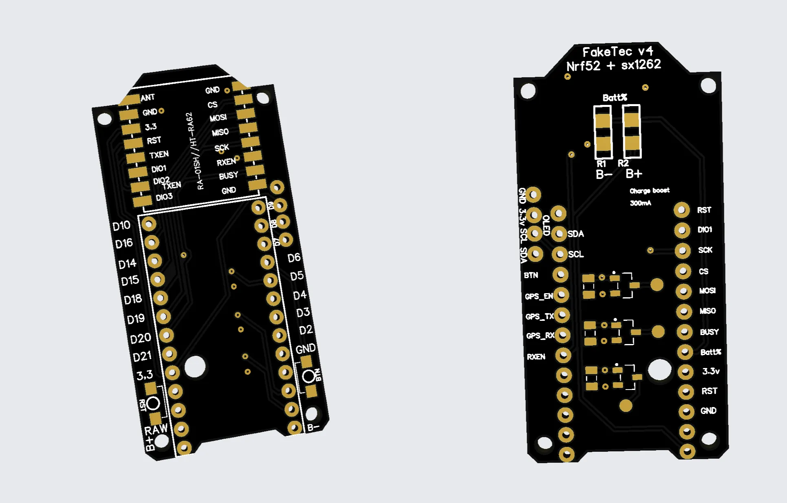

如果你是 Meshtastic 玩家，你一定听说过 Heltec V3 这款 LoRa 设备。它便宜、易用、受到社区的热爱，但续航问题一直让人头疼：ESP32 作为主控芯片，功耗太高，哪怕加上大容量电池，使用时间仍然有限。

假如你希望你的 Meshtastic 设备能低成本、低功耗运行更长时间，你会怎么做？  

这就是 fakeTec 诞生的意义！

## fakeTec 是什么？

fakeTec 是一个开源 DIY 项目，它的目标是用功耗更低的 nRF52 处理器替换 Heltec V3 的 ESP32，同时保持与 Heltec V3 外壳、配件的兼容性。 这样你不仅可以用更低的成本获得一台性能更好的设备，还能直接替换原来的 Heltec V3，无需重新设计外壳、天线等配件。  

fakeTec 由社区爱好者发起，并在 GitHub 仓库 [gargomoma/fakeTec_pcb](https://github.com/gargomoma/fakeTec_pcb) 公开了所有设计文件，包括：
- 电路板生产文件（PCB Gerber）
- 元件清单（BoM）
- 固件支持
- 3D 打印外壳设计（由社区不同 fakeTec 爱好者设计并无私贡献，下一篇文章会详细介绍）  

由于它完全开源，并且所有零件都可以在淘宝、拼多多或其他电商平台轻松买到，这让 fakeTec 成为了一个极具吸引力的 DIY 方案。

fakeTec 这个名字带点幽默的味道——它并不是官方的 Heltec 设备，但外形、尺寸几乎一样，还能兼容 Heltec V3 的外壳。某种意义上，它是 Heltec V3 的“平替”（Fake + Heltec = fakeTec），但更便宜、更省电、体验更好！  

这就是 fakeTec，一个由社区驱动的、有趣又实用的 Meshtastic 设备平替方案。  

## fakeTec 的优点

在 Meshtastic 设备的世界里，fakeTec 之所以能迅速受到 DIY 爱好者的欢迎，关键在于它的四大优点。

### 1. 价格更便宜，性价比更高

购买一个 Meshtastic 开发板，当前我们中国社区比较流行的选择有以下两个：  
- Heltec LoRa32 V3（简称 Heltec V3）：约 100 元，采用 ESP32 芯片，功耗较高。当前的性价比选项。
- Heltec T114：价格区间 189-299 元，采用 nRF52 低功耗 MCU，是 Heltec 的低功耗 Meshtastic 设备。当前制作太阳能节点的不二之选。

相比之下，fakeTec 只需要 35-50 元，具体成本如下：
| 组件          | 价格（人民币 ¥） | 备注 |
|--------------|---------------|------|
| ProMicro (nRF52 版) | 10-20 | 主控 MCU，低功耗 |
| Heltec HT-RA62 LoRa 模块 | 22 | LoRa 通信核心（二选一） |
| 安信可 RA-01S LoRa 模块 | 20-25 | 另一种 LoRa 模块选择（二选一），注意频率范围，带 H（代表 High frequency）后缀的 `RA-01SH` 是 900 MHz 频率，国内应该是使用 470 MHz |
| fakeTec PCB（10 块起订） | 5 / 每块 PCB | 视订单数量会更便宜 |

综合来看，最便宜的情况下，你只需要 35 元左右就能组装一台 fakeTec，最贵也不过 50 元。

对比 Heltec 官方现有方案：
- 比 Heltec V3 便宜一半以上（Heltec V3 ¥100 vs fakeTec ¥35-50）  
- 比 Heltec T114 便宜 4-6 倍（Heltec T114 ¥189-299 vs fakeTec ¥35-50）  

Heltec T114 和 fakeTec 采用相同的 MCU，因此功耗可以视为接近一致，但 fakeTec 提供了更自由的 DIY 选项，让你自己选择组件，如屏幕、电池、外壳等，完全可以根据自己的需求搭配，而不会像 T114 一样受官方套餐限制。

### 2. 功耗极低，续航提升数倍

Heltec V3 使用的是 ESP32 芯片，功耗较高，在 LoRa 通信模式下，即使使用大容量电池，续航也往往只有 1-2 天。  

fakeTec 采用的是 Nordic nRF52 系列芯片，功耗比 ESP32 低得多，续航可以提高 5-8 倍！

Reddit 上的用户实测：
- 使用 650mAh 电池的 fakeTec 设备，在中等负载下可以运行 5-7 天，甚至更久  
- 相同电池容量下，ESP32 设备的续航时间不到 1/5  

相比之下，Heltec T114 也是基于 nRF52 的低功耗设计，续航能力接近 fakeTec，但价格是 fakeTec 的 4-6 倍，而且 fakeTec 允许用户自由调整电池、外壳和供电方案，拓展性更强。

### 3. 完全兼容 Heltec V3 外壳，升级无压力

fakeTec 的 PCB 设计尺寸与 Heltec V3 几乎一致，高度稍微不同。这意味着你可以只做小量改动，就能使用 Heltec V3 的外壳设计，无需从头设计。

对于已经购买了 Heltec V3 设备的用户，fakeTec 提供了一种低成本升级路径，你无需淘汰整个设备，只需更换 PCB，瞬间让设备从高功耗 ESP32 升级为低功耗 nRF52，大幅提升续航表现。

### 4. 完全开源，社区支持强  

fakeTec 是一个由社区驱动的 DIY 项目，所有设计文件、固件、PCB 生产文件、3D 打印外壳设计，全部开源，你可以随意修改、定制、改进！

fakeTec 作为一个不断优化的开源硬件项目，从 v1 版本到 v4 版本经过了多个社区成员的努力和改进：
- v1 - v3：由 fakeTec 项目的创建者 gargomoma 设计并分享。
- v4：最新版本的 fakeTec PCB 由社区成员 lupusworax 重新设计并改进，这意味着 fakeTec 进入了一个真正由社区驱动的阶段，让不同贡献者能够参与优化和升级硬件。新版 v4 由社区成员 lupusworax 设计，并由他的同事 Severin 从零开始重新绘制 PCB。

当前最新的 fakeTec v4 版本进行了多项优化，使其在可扩展性和易用性上有了很大的提升：
- 新增 3 个 MOSFET 以便更好地控制外接设备，并添加了下拉电阻和更适合焊接的焊盘。  
- 去除了 THT（过孔）电压分压器，现在仅支持 SMD 电阻，优化了电路设计。  
- 新增 3 个 GPIO 端口 供外部设备使用：
  - GPIO 24：GPS 使能控制  
  - GPIO 6、GPIO 8：用于其他外设控制  
- 优化了外设连接方式，外接硬件的正极直接连接，GND 通过 MOSFET 控制，实现更可靠的开关控制。  

目前，fakeTec 项目在 GitHub 上的内容包括：
- 完整的 PCB 生产文件
- 详细的元件清单（BOM）
- 推荐的固件版本和刷机方法
- 多个用户无私贡献的开源 3D 打印外壳（下一篇文章会详细介绍）

在 Reddit 和 Discord 上，fakeTec 也有活跃的讨论区，许多用户都分享了自己的优化方案和问题解决方法。我们 MeshCN 中国 Meshtastic 社区也有大量成员在玩 fakeTec。如果你在组装或使用过程中遇到问题，社区能提供很好的支持！  

## fakeTec 适用于哪些用户？  

fakeTec 作为一个开源 DIY 项目，与市面上的开箱即用设备不同，它要求用户具备一定的动手能力，并愿意投入时间去完成从硬件采购到软件调试的全过程。

由于 fakeTec 并不像 Heltec V3 或 Heltec T114 那样提供即插即用的成品，用户在使用前需要自己完成几个重要的步骤：  

- 下单制作 PCB —— fakeTec 并没有现成出售的电路板，用户需要自行在 PCB 制造商（如 JLCPCB）上传 Gerber 文件并下单生产。  
- 焊接组装 —— 购买 nRF52 开发板、LoRa 模块、电阻、电容等元件，并自己焊接到 PCB 上。  
- 刷写 Bootloader —— 大部分 nRF52 开发板出厂时可能没有适用于 Meshtastic 的 Bootloader，因此用户需要手动烧录 Bootloader。  
- 烧录 Meshtastic 固件 —— 刷入适用于 fakeTec 设备的 Meshtastic 固件，使其能够加入 Meshtastic 网络并正常通信。  

这意味着，fakeTec 并不适合所有人。如果你对焊接电子元件、刷固件、调试无线设备完全没有兴趣，只是希望有一个开箱即用的 Meshtastic 设备，fakeTec 可能并不适合你。

相比之下，Heltec T114 是更理想的选择，它使用了同样低功耗的 nRF52 芯片，并且开箱即可使用，不需要额外的焊接、烧录过程，因此在社区内也受到很多人的推荐。如果你更希望获得即插即用的体验，并且愿意支付额外的成本，Heltec T114 可能会更适合你的需求。  

那么，fakeTec 更适合哪些用户呢？从目前社区的反馈来看，这个项目更适合已经玩遍了现有 Meshtastic 设备，希望挑战更复杂 DIY 过程的进阶玩家。如果你已经熟悉 Meshtastic 网络，并希望以更低的成本自制节点，或者对 Heltec V3 的高功耗不满，想要升级到更低功耗的 nRF52 方案，fakeTec 就是一个值得尝试的选项。它不仅能够让你在 DIY 过程中学到更多关于无线通信、硬件焊接和固件调试的知识，还能在你完成组装后，获得一个更具个性化的 Meshtastic 设备。  

当然，DIY 过程并不意味着你必须独自摸索。如果你在 [Meshtastic 中国社区的微信群](/contact/) 里，群友们会提供各种技术支持，帮助你避开可能遇到的坑。但即便如此，你仍然需要做好心理准备，因为 fakeTec 不是那种一插电就能用的设备，而是需要投入一定时间和精力去完成的 DIY 项目。

如果你只是为了省钱，而对折腾硬件和软件没有兴趣，fakeTec 可能会带来不小的挫折感。

但如果你乐于挑战、愿意尝试新事物，并且对无线通信技术充满兴趣，fakeTec 绝对是一个值得探索的项目，它不仅能让你深入了解 Meshtastic 设备的工作原理，还能为你的无线通信网络增添更多乐趣。  

## 如何上手 fakeTec？  

想要体验 fakeTec 的强大功能，首先需要准备相应的硬件组件，然后进行焊接组装、固件刷写，并最终完成 Meshtastic 网络配置。

虽然 fakeTec 是一个 DIY 项目，但由于社区已经提供了完整的硬件清单（BOM）和刷机教程，整个上手过程并不复杂，即使是没有太多电子硬件经验的用户，也可以轻松完成 fakeTec 的搭建。  

- 下单制作 PCB —— fakeTec 并没有现成出售的电路板，用户需要自行在 PCB 制造商（如 JLCPCB）上传 Gerber 文件并下单生产。  
- 焊接组装 —— 购买 nRF52 开发板、LoRa 模块、电阻、电容等元件，并自己焊接到 PCB 上。  
- 刷写 Bootloader —— 大部分 nRF52 开发板出厂时可能没有适用于 Meshtastic 的 Bootloader，因此用户需要手动烧录 Bootloader。  
- 烧录 Meshtastic 固件 —— 刷入适用于 fakeTec 设备的 Meshtastic 固件，使其能够加入 Meshtastic 网络并正常通信。  

### 准备所需的硬件组件  

fakeTec 的核心硬件包括三部分：nRF52 主控板、LoRa 通信模块、fakeTec PCB。其中，nRF52 主控板决定了设备的计算和通信能力，LoRa 模块负责无线通信，而 fakeTec PCB 则是整个设备的连接载体，保证各个组件可以顺利组装在一起。  

目前，fakeTec 使用 ProMicro (nRF52 版) 作为主控芯片，这种开发板的价格大约在 10-20 元，用户可以在淘宝轻松购买。

至于 LoRa 模块，fakeTec 支持多个品牌的 LoRa 模块，同时支持带 TCXO 和不带 TXCO 的芯片。我建议购买带 TCXO 的 LoRa 芯片，性能较好。

> 温度补偿晶振（TCXO），选择带 TCXO 的 LoRa 模块对于 Meshtastic 的太阳能节点或户外节点至关重要，因为这些设备通常暴露在温差较大的环境中（如白天高温与夜晚低温）。TCXO 能自动补偿温度引起的频率漂移，确保在远距离通信中保持稳定的信号质量和可靠性。

不同品牌的 LoRa 芯片价格都是二十块左右，比如 Heltec HT-RA62、~~EByte E22~~、安信可 RA-01SH 等等。用户可以根据自己手头的资源进行选择。



虽然 fakeTec 项目的 [原始 README](https://github.com/gargomoma/fakeTec_pcb/blob/main/README.md) 里推荐了 EByte E22 模块，但这实际上是针对国外的 LoRa 频段（如 868 MHz 或 915 MHz）设计的。

在 中国 470 MHz 频段，E22 模块的引脚排列和封装大小与 fakeTec PCB 设计的不匹配。如果你在中国使用 470 MHz 版本的 E22，会发现它无法直接焊接到 fakeTec PCB 上，除非飞线连接，否则无法正常使用。

这已经是多个社区成员犯下的错误，因此在选择 LoRa 模块时务必留意，避免踩坑。



最后，fakeTec PCB 需要用户自行下单制造，具体价格取决于生产数量，如果按照 10 块起订，单块 PCB 的成本大约在 5 元以内，如果批量生产成本会更低。

你需要访问 fakeTec PCB 项目的 [gerbers 文件夹](https://github.com/gargomoma/fakeTec_pcb/tree/main/gerbers)，下载最新的 v4 版本 PCB 生产文件（ZIP 压缩包）。这一版本相比之前有显著改进，建议优先选择。下载完成后，将文件上传至任意 PCB 生产平台进行制造。这些文件采用通用格式，不受限于特定平台。目前，社区用户较常选择 JLC PCB 进行打板，他们的推广力度较大，时常能领取免费打板优惠券。

在采购硬件时，用户可以根据自己的需求选择是否添加额外组件，例如 OLED 屏幕（用于显示状态信息）、电池接口（方便电池供电）。这些组件并不是 fakeTec 必需的部分，但如果需要更完整的功能体验，可以考虑一并购入。

除此之外，还需要按照 fakeTec_pcb 项目的 README.md 里的 Bill of Material，购买电阻、按键。这些都是很通用的东西，没有特定品牌，只需要保证和设计大小一致即可。

### 焊接组装 fakeTec 设备  

在拿到所有硬件后，下一步就是焊接和组装 fakeTec 设备。fakeTec PCB 的设计已经考虑到了 兼容 Heltec V3 外壳，因此用户不需要额外设计固定结构，而只需按照 PCB 板上的焊盘位置，将 nRF52 开发板、LoRa 模块、电阻、电容等元件依次焊接到 PCB 上。  

对于焊接经验较少的用户，建议使用助焊剂和细焊锡，并且在正式焊接前先进行测试，确保所有元件的位置正确无误。



针对 ProMicro (nRF52 版) 开发板，在组装焊接之前建议先测试 Bootloader 是否正常，以免焊接后才发现无法刷机。

我建议先烧录好 Bootloader 以及 Meshtastic 固件到 ProMicro 开发板上，发现没有问题了，再进行组装和焊接。在后续排查中，这种做法可以排除掉软件的问题。

详细 nRF52 Promicro 烧录教程请参考《[T114 杀手？焊武帝 35 块 DIY nRF52 Meshtastic 节点](/meshtastic-diy-nrf52840-lora-sx1262-setup/#三、刷固件-烧录过程)》的固件烧录章节，涉及到使用 `adafruit-nrfutil` 和 Meshtastic CLI 命令行去进行 erase 操作以及烧录。



在 Reddit 讨论区，有用户提到，在某些情况下，在 LoRa 模块的电源引脚和地之间额外焊接一个 4.7uF 或 3.3uF 的电容，可以有效提升信号稳定性，避免长距离通信时出现丢包现象。虽然 fakeTec 官方设计中没有强制要求这个优化，但如果遇到信号不稳定的问题，用户可以尝试这个方法进行改进。

### 刷入 Meshtastic 固件  

完成硬件组装后，fakeTec 还需要刷入 Meshtastic 固件才能正常工作。相比 Heltec V3 设备，fakeTec 的刷机过程要稍微复杂一些，因为 ProMicro (nRF52 版) 默认的 Bootloader 版本可能较低，需要先手动更新。用户可以使用 USB 连接 fakeTec 设备，并双击 RST 和 GND 引脚，进入 Bootloader 模式，之后将最新的 update-nice_nano_bootloader-0.9.2_nosd.uf2 文件拖入设备，即可完成 Bootloader 更新。  

更新 Bootloader 之后，就可以开始刷写 Meshtastic 固件。fakeTec 设备兼容官方的 ProMicro nRF52 变种固件，但更推荐使用社区开发者 mrekin 提供的 Web Flasher 在线刷机工具，这个工具可以自动识别 fakeTec 设备，并帮助用户选择合适的固件版本。刷机方法很简单，只需在浏览器中打开 mrekin.duckdns.org/flasher，然后按照页面指引选择 nRF52 ProMicro 变种固件，点击 "Flash" 按钮，等待几分钟即可完成固件写入。  

刷机完成后，fakeTec 会自动重启，此时用户可以打开 Meshtastic 手机 App，尝试连接 fakeTec 设备。首次连接时，设备可能会显示默认的频道信息，用户可以手动修改频道 ID，确保它与已有的 Meshtastic 网络匹配。如果 fakeTec 设备需要 GPS 功能，用户还可以在 App 中启用 GPS 选项，并通过 I2C 接口连接外部 GPS 模块，从而实现更强大的定位功能。

后续如果社区反馈需求的话，我会写一篇额外的 fakeTec 烧录教程给大家。如果有什么疑问，欢迎 [加入中国社区交流群](/contact/) 询问。

### 调试和优化 fakeTec 设备  

在完成硬件组装和刷机之后，建议用户进行一些基本的调试和优化，以确保 fakeTec 设备能够稳定运行。首先，可以使用 Meshtastic App 或 Web 界面观察 fakeTec 是否能够正常发送和接收 LoRa 数据包。如果发现信号不稳定，可能需要调整天线位置，或者更换更高质量的天线适配器。此外，一些用户在使用 fakeTec 设备时，可能会遇到长消息传输失败的问题，这通常可以通过 在 LoRa 模块上增加额外的去耦电容 来解决。  

对于希望进一步优化 fakeTec 续航的用户，可以考虑使用更高效的电池管理方案，例如搭配 [MPPT 太阳能充电模块](/T114-solar-panel-requirement-calculate/)，或者使用更大容量的锂电池组。由于 nRF52 的功耗极低，fakeTec 非常适合长期供电方案，因此许多用户已经在 fakeTec 设备上尝试使用太阳能供电，使其成为真正的零维护 Meshtastic 远程节点。  

fakeTec 的上手过程虽然需要一些 DIY 经验，但总体来说并不复杂。凭借其低成本、高兼容性和强大的扩展能力，fakeTec 已经成为 Meshtastic 社区中最受欢迎的 DIY 方案之一。对于想要尝试自己动手搭建 Meshtastic 设备的用户来说，fakeTec 无疑是一个极具吸引力的选择。  

## 结语  

fakeTec 是一个由社区驱动的 DIY 项目，它提供了一种低成本、高效能的 Meshtastic 设备解决方案。

对于那些希望建立低成本 Meshtastic 网络的用户，fakeTec 让每个节点的成本降至 35-50 元，这意味着相同的预算可以部署更多的设备，从而提升整个网络的覆盖范围和稳定性。  

除了价格优势，fakeTec 最令人印象深刻的就是它的低功耗特性。nRF52 处理器的能效比 ESP32 高出数倍，使得设备的续航时间大幅延长。在相同的电池容量下，fakeTec 设备可以持续运行 5-10 倍的续航时间，极大地降低了用户频繁充电或更换电池的麻烦。对于那些希望长期部署 Meshtastic 设备的用户来说，fakeTec 的低功耗特性使其成为一种更为可靠的选择。  

更重要的是，fakeTec 继承了开源社区的精神，它不仅提供了完整的 PCB 生产文件和固件支持，还允许用户根据自己的需求进行自由改造。无论是希望增加 GPS 模块，还是优化电池管理方案，甚至是 3D 打印不同形态的外壳，fakeTec 都为 DIY 爱好者提供了无限的可能性。社区中的贡献者们已经开发了多种不同的扩展玩法，并且不断优化 fakeTec 的设计，使其适用于更多的应用场景。  

在 Meshtastic 生态系统中，fakeTec 是社区创造力的体现。它代表了一种社区自主创新的精神，使得更多用户能够以更低的门槛加入到 Meshtastic 的世界中。未来，随着社区的持续发展，fakeTec 可能会迎来更多优化和扩展，甚至衍生出更加多样化的版本，满足不同用户的需求。

目前，基于 fakeTec 的外壳设计已经超过十种，每款都由社区无私开源。其中，有受 SenseCap T1000-E 启发的卡片式设计——fakeCap（名字一看就懂🐕），也有外形酷似药丸💊、具备 IP65 级防水能力，适合野外徒步、登山等场景使用的坚固外壳。接下来，我会为每款优秀的 fakeTec 外壳设计撰写介绍文章，记得定期关注我们的更新哦！

对于那些仍在犹豫是否要尝试 fakeTec 的人来说，不妨考虑这样一个问题：如果有一款设备，成本低、续航长、可自由定制，并且拥有庞大的社区支持，它是否值得一试？答案显然是肯定的。

fakeTec 正是这样一个方案，它为 Meshtastic 用户提供了一种集体智慧、具性价比的选择。如果你对无线通信、DIY 硬件、甚至是开源社区的精神感兴趣，那么 fakeTec 绝对值得你去尝试。  